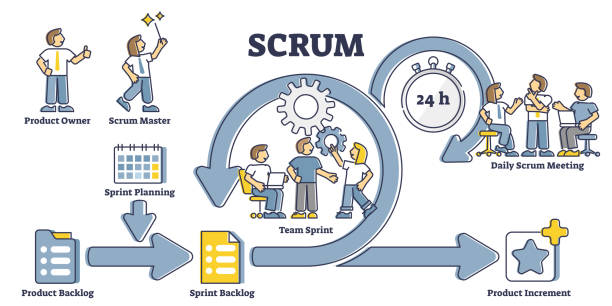
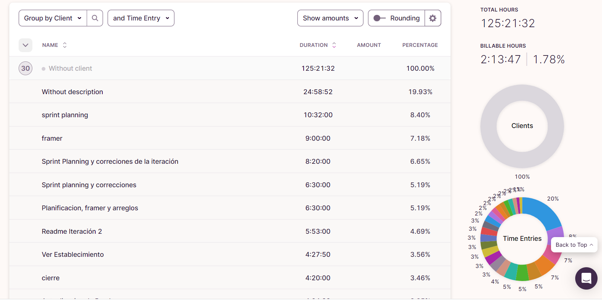
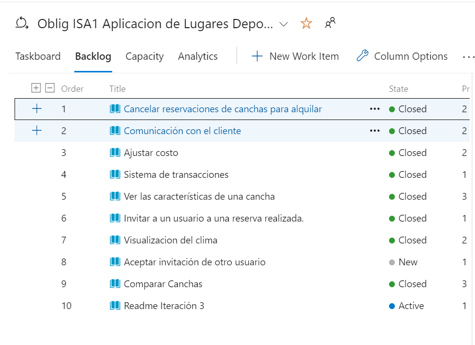
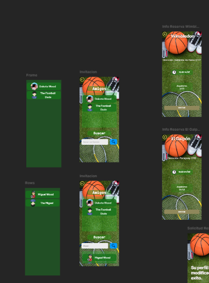
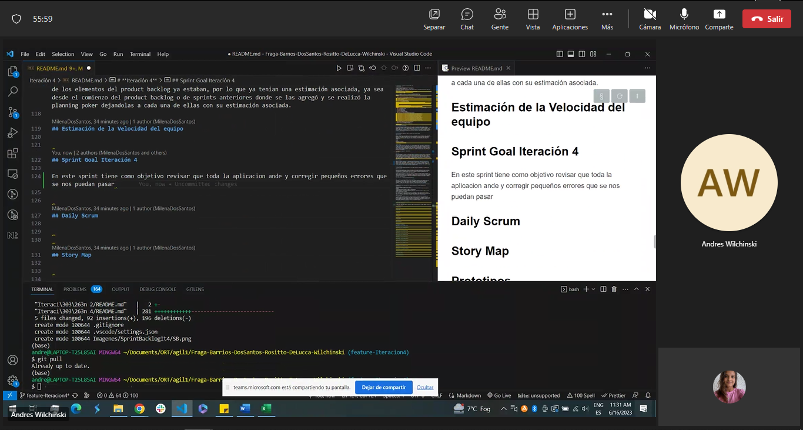

# ***Proyecto de Ingeniería de Software Ágil***

| Identificación   |
| ----------------------------------------------- |
| Integrantes: Milena Dos Santos, Andrés Fraga, Federico Barrios, Giuliano Rositto, Nicolás De Lucca, Andrés Wilchinski |
| Nombre de la Aplicación: PartidoFácil |
| Link al vídeo con la Demo: https://www.youtube.com/watch?v=sCFZwjHa-Ck |

# Indice

1. [Iteración 1](#iteración-1)
    1. [Que es una iteración?](#que-es-una-Iteración?) 	
    1. [Definición del marco de trabajo](#definición-del-marco-de-trabajo)
    1. [Valores](#valores)
    2. [Roles](#roles)
    3. [Eventos](#eventos)
    4. [Artefactos](#artefactos)
    5. [Principios](#principios)
    2. [Definition of Done](#definition-of-done)
    3. [Definition of Ready](#definition-of-ready)
    4. [Repositorio](#repositorio)
    5. [Adaptaciones de la modalidad SCRUM](#adaptaciones-de-la-modalidad-scrum)
        1. [Roles asumidos por el equipo](#roles-asumidos-por-el-equipo)
    6. [Herramientas de trabajo](#herramientas-de-trabajo)
        1. [Retrospectiva](#retrospectiva)
        2. [TaskBoard Scrum Team](#taskboard-scrum-team)
    7. [Evidencia de actividaes de investigación](#evidencia-de-actividades-de-investigación)
        1. [Tormenta de Ideas](#tormenta-de-ideas)
        2. [Encuestas](#encuestas)
        3. [Ingeniería Inversa](#ingenieria-inversa)
            1. [Estudio de Competidores](#estudio-de-competidores)
            2. [Tabla de funcionalidades](#tabla-de-funcionalidades)
        4. [Identificación de Interesados](#identificación-de-interesados)
        5. [Referencia a fuentes de Información](#referencias-a-fuentes-de-información)
    8. [Sprint Goal](#sprint-goal)
        1. [Sprint Goal Iteración 1](#sprint-goal-de-la-iteración-1)
    9. [Especificación](#especificación)
        1. [Definición de Requerimientos](#definición-de-requerimientos)
            1. [Requerimientos Funcionales](#requerimientos-funcionales)
            	1. [Funcionalidad y a que stakeholder beneficia](#funcionalidad-y-a-que-stakeholder-beneficia)
            2. [Requerimientos No Funcionales](#requerimientos-no-funcionales)
        3. [Valor agregado de nuestra aplicación para los stakeholders](#Valor-agregado-de-nuestra-aplicación-para-los-stakeholders)
    10. [Artefactos de SCRUM Iteración 1](#artefactos-de-scrum-iteración-1)
        1. [Product Backlog Items](#product-backlog-items)
            1. [Product Backlog inicial](#product-backlog-inicial)
	    2. [User Stories](#user-stories)
	    3. [Criterios de Aceptación](#criterios-de-aceptación) 
    11. [Product Backlog agrupado por épicas](#product-backlog-grupado-por-épicas)
    12. [Story Map](#story-map)
        1. [Story Map Iteración 1](#story-map-de-la-iteración-1)
    12. [Eventos de Scrum Iteración 1](#eventos-de-scrum-iteración-1)
        1. [Sprint Planning](#sprint-planning)
            1. [Planning Poker](#planing-poker)
        2. [Sprint Retrospective](#spring-retrospective)
2. [Iteración 2](#iteración-2)
    1. [Roles](#roles-asumidos-por-el-equipo-1)
    2. [Herramientas de trabajo](#Herramientas-de-trabajo)
	    1. [Toggl Track](#Toggl-Track)
	    2. [Metro Retro](#Metro-Retro)
	    3. [Framer](#Framer)
    3. [Sprint Planning](#sprint-planning)
	    1. [Sprint Backlog](#Sprint-Backlog)
		    1. [Objetivo del Sprint](#¿por-qué-es-valioso-este-sprint-objetivo-del-sprint)
		    2. [Elementos del Product Backlog seleccionados para el Sprint](#¿qué-se-puede-hacer-en-este-sprint-elementos-del-product-backlog-seleccionados-para-el-sprint)
		    3. [Planing Poker](#planing-poker)
		    4. [Plan para entregar el Incremento](#¿cómo-se-realizará-el-trabajo-elegido---plan-para-entregarlos)
    4. [Sprint Goal](#sprint-goal-iteración-2)
    5. [Daily Scrum](#daily-scrum)
    6. [Story Map](#story-map)
    7. [Prototipos](#prototipos)
    8. [Incremento](#incremento)
    9. [Sprint Review](#sprint-review)
    10. [Metricas](#metricas)
        1. [BurnDown Chart](#burndown-chart)
        2. [Velocidad del equipo:](#velocidad-del-equipo)
    11. [Validación con Usuarios](#validación-con-usuarios)
	    1. [Validación con el primer usuario](#validación-con-el-primer-usuario)
	    2. [Validación con el segundo usuario](#validación-con-el-segundo-usuario)
	    3. [Validación con el tercer usuario](#validación-con-el-tercer-usuario)
	    4. [Validación con el cuarto usuario](#validación-con-el-cuarto-usuario)
	    5. [Incorporar las ideas de los usuarios al prototipo](#incorporar-ideas-de-los-usuarios-al-prototipo)
    12. [Registro de horas](#registro-de-horas)
    13. [Sprint Retrospective](#sprint-retrospective)
3. [Iteración 3](#iteración-3)
    1. [Roles](#Roles-asumidos-por-el-equipo)
    2. [Herramientas de trabajo](#Herramientas-de-trabajo)
	    1. [Toggl Track](#Toggl-Track)
	    2. [Metro Retro](#Metro-Retro)
	    3. [Framer](#Framer)
	    4. [Azure boards](#Azure-boards)
    3. [Sprint Planning](#sprint-planning)
	    1. [Sprint Backlog](#Sprint-Backlog)
		    1. [Objetivo del Sprint](#¿por-qué-es-valioso-este-sprint-objetivo-del-sprint)
		    2. [Elementos del Product Backlog seleccionados para el Sprint](#¿qué-se-puede-hacer-en-este-sprint-elementos-del-product-backlog-seleccionados-para-el-sprint)
		    3. [Planing Poker](#planing-poker)
		    4. [Plan para entregar el Incremento](#¿cómo-se-realizará-el-trabajo-elegido---plan-para-entregarlos)
		    5. [Estimación de la Velocidad del equipo](#estimación-de-la-velocidad-del-equipo)
    4. [Sprint Goal](#sprint-goal-iteración-3)
    5. [Daily Scrum](#daily-scrum)
    6. [Story Map](#story-map)
    7. [Prototipos](#prototipos)
    8. [Incremento](#incremento)
    9. [Sprint Review](#sprint-review)
    10. [BurnDown Chart](#burndown-chart)
    11. [Validación con Usuarios](#validación-con-usuarios)
        1. [Validación con el primer usuario](#validación-con-el-primer-usuario)
        2. [Validación con el segundo usuario](#validación-con-el-segundo-usuario)
        3. [Validación con el tercer usuario](#validación-con-el-tercer-usuario)
        4. [Validación con el cuarto usuario](#validación-con-el-cuarto-usuario)
        5. [Validación con el quinto suario](#validación-con-el-quinto-usuario)
        6. [Validación con el sexto usuario](#validación-con-el-sexto-usuario)
        7. [Validación con el septimo usuario](#validación-con-el-septimo-usuario)
        8. [Validación con el octavo usuario](#validación-con-el-octavo-usuario)
        9. [Validación con el noveno usuario](#validación-con-el-noveno-usuario)
        10. [Validación con el décimo usuario](#validación-con-el-décimo-usuario)
        11. [Validación con el onceavo usuario](#validación-con-el-onceavo-usuario)
        12. [Incorporar las ideas de los usuarios al prototipo](#incorporar-ideas-de-los-usuarios-al-prototipo)
    12. [Registro de horas](#registro-de-horas)
    13. [Sprint Retrospective](#sprint-retrospective)
4. [Iteración 4](#iteración-4)
    1. [Roles y responsabilidades de cada integrante del equipo](#roles-asumidos-por-el-equipo)
    2. [Herramientas de trabajo](#herramientas-de-trabajo)
        1. [Toggl Track](#toggl-track)
        2. [Metro Retro](#metro-retro)
        3. [Framer](#framer)
        4. [Azure boards](#azure-boards)
    3. [Sprint Planning](#sprint-planning)
        1. [Sprint Backlog](#sprint-backlog)
            1. [Objetivo del Sprint](#¿por-qué-es-valioso-este-sprint-objetivo-del-sprint)
            2. [Elementos del Product Backlog seleccionados para el Sprint](#¿qué-se-puede-hacer-en-este-sprint-elementos-del-product-backlog-seleccionados-para-el-sprint)
            3. [Planing Poker](#planing-poker)
            4. [Estimación de la Velocidad del equipo](#estimación-de-la-velocidad-del-equipo)
    4. [Sprint Goal](#sprint-goal-iteración-4)
    5. [Daily Scrum](#daily-scrum)
    6. [Story Map](#story-map)
    7. [Prototipos](#prototipos)
    8. [Incremento](#incremento)
    9. [Sprint Review](#sprint-review)
    10. [BurnDown Chart](#burndown-chart)
    11. [Validación con Usuarios](#validación-con-usuarios)
        1. [Validación con el primer usuario](#validación-con-el-primer-usuario)
        2. [Validación con el segundo usuario](#validación-con-el-segundo-usuario)
        3. [Validación con el tercer usuario](#validación-con-el-tercer-usuario)
        4. [Validación con el cuarto usuario](#validación-con-el-cuarto-usuario)
        5. [Validación con el quinto suario](#validación-con-el-quinto-usuario)
        6. [Validación con el sexto usuario](#validación-con-el-sexto-usuario)
        7. [Validación con el septimo usuario](#validación-con-el-septimo-usuario)
        8. [Validación con el octavo usuario](#validación-con-el-octavo-usuario)
        9. [Validación con el noveno usuario](#validación-con-el-noveno-usuario)
        10. [Validación con el décimo usuario](#validación-con-el-décimo-usuario)
        12. [Incorporar las ideas de los usuarios al prototipo](#incorporar-ideas-de-los-usuarios-al-prototipo)
    12. [Registro de horas](#registro-de-horas)
    13. [Sprint Retrospective](#sprint-retrospective)
# **Iteración 1**

# Que es una Iteración?

Una Iteración según el Marco de trabajo SCRUM, es un período de tiempo predefinido que puede ir entre 2 semanas a 4 meses, cuanto más pequeño más manejable.
Dentro de esa iteración o también conocido como Sprint el equipo de desarrollo trabaja en un conjunto de tareas del backlog del producto acordados previamente.

# Definición del marco de trabajo

Para el contexto de trabajo propuesto, se realizará utilizando el marco de trabajo (framework) ágil SCRUM.
Scrum es un marco de trabajo ágil utilizado para el desarrollo de proyectos complejos y cambiantes. Al utilizarlo, se busca maximizar la colaboración, flexibilidad y transparencia para lograr un desarrollo de alta calidad y aumentar la satisfacción del cliente.

## VALORES

Los valores de Scrum son la base para la cultura y la práctica del desarrollo ágil. Éstos se usan como una guía para tomar decisiones y actuar en el proceso de desarrollo de un producto en Scrum:

- Compromiso: El equipo de desarrollo y los stakeholders están comprometidos con el éxito del proyecto y trabajan juntos hacia un objetivo común.

- Coraje: El equipo tiene el coraje de tomar decisiones y asumir responsabilidades en el proceso de desarrollo del producto.

- Enfoque: El equipo se enfoca en el trabajo actual y en el logro de los objetivos del Sprint.

- Transparencia: El equipo es transparente en su trabajo y comunica de manera efectiva con los stakeholders.

- Respeto: El equipo muestra respeto hacia sus colegas y stakeholders, reconociendo sus habilidades y contribuciones al proyecto.

## ROLES

En SCRUM existen tres roles oficiales que conforman al SRCUM TEAM que es un pequeño equipo conformado por un Scrum Master, un Product Owner y Developers los cuales se detallan a continuación. Dentro de este no hay subequipos ni jerarquías, todos deben estar enfocados en un mismo objetivo, el objetivo del producto. Los miembros de un Scrum Team deben tener todas las habilidades necesarias para crear un incremento de valor en cada sprint esto significa que deben ser multifuncionales y también autogestionados.
Todos los miembros del Scrum Team son responsables de crear un incremento valioso y útil en cada sprint.

- **PRODUCT OWNER**: Es el encargado de definir y priorizar los requisitos del producto, y de comunicar el valor de negocio que se busca alcanzar. Es responsable de maximizar el valor del producto resultante de trabajo del Scrum Team, también es el encargado de gestionar efectivamente al Product Backlog, desarrollando y comunicando explícitamente el objetivo del producto, crear, comunicar y ordenar los elementos del Product Backlog y asegurarse de que el Product Backlog sea transparente, visible y se entienda.

- **SCRUM MASTER**: El Scrum Master es el responsable de lograr la efectividad del Scrum Team, para lograrlo lo que hace es guiar al Scrum Team para mejorar sus prácticas dentro del marco de trabajo Scrum.
El Scrum Master es un líder que sirve al Scrum Team de varias maneras, algunas de ellas son Guiando a los miembros del equipo en ser autogestionados y multifuncionales, ayudando al Scrum Team a enfocarse en crear Incrementos de alto valor que cumplan con lo acordado como Definition of Done, eliminando impedimentos para el progreso del Scrum Team, asegurándose de que todos los eventos de Scrum se cumplan correctamente, entre otras.

- **DEVELOPMENT TEAM**: Este equipo se compromete a crear cualquier aspecto de un incremento utilizable en cada sprint, estos siempre son responsables de crear un plan para el sprint, el sprint backlog, inculcar calidad al adherirse a una Definción de terminando (Definition of Done), adaptar su plan cada día hacia el objetivo del Sprint y responsabilizarse mutuamente como profesionales.

Nota: En algunos casos puede haber stakeholders externos al equipo que pueden participar en la planificación y revisión de los Sprints. Sin embargo, estos no son considerados roles oficiales en Scrum.

## EVENTOS

Esta metodología de trabajo se compone de 5 ceremonias, las cuales ayudan a los equipos a alcanzar sus objetivos y mejorar continuamente, las mismas son:

- SPRINT: Un Sprint en Scrum es una iteración corta y planificada en el desarrollo del proyecto, en la que se busca mejorar el valor del mismo mediante el cumplimiento  de objetivos específicos. Durante este período de tiempo, el equipo trabaja para completar un conjunto de tareas y alcanzar el objetivo previamente establecido. La meta es entregar una versión mejorada  del producto al final del sprint. La duración de un sprint normalmente es entre 2 y 4 semanas.

- SPRINT PLANNING: Durante esta reunión, se establece el objetivo del Sprint, es decir, el resultado esperado que se quiere lograr durante el período de tiempo del Sprint. Se discute y se acuerda un conjunto de funcionalidades que deben ser entregadas al final del Sprint. La Sprint Planning se realiza al principio de cada sprint. Participan el equipo de desarrollo, el Scrum Master y el Product Owner. En un Sprint de 2 semanas lo ideal es que dure aproximadamente 4 horas, mientras que para sprints de 4 semanas lo esperable es que lleve 8 horas.

- DAILY SCRUM: Reunión diaria de sincronización donde se inspecciona el progreso hacia el objetivo del Sprint. Se busca adaptar el Sprint Backlog según sea necesario, ajustando el próximo trabajo planificado. Cada miembro del equipo debe responder: Qué hizo el día anterior, qué hará ese día y si tiene algún impedimento para continuar. Algo a destacar es que idealmente se debe hacer todos los días en el mismo lugar y horario y no debe durar más de 15 minutos. Los participantes deben ser el equipo de desarrollo y el Scrum Master.

- SPRINT REVIEW: El propósito del Sprint Review es inspeccionar los resultados del Sprint y determinar futuras adaptaciones. El equipo de Scrum presenta los resultados de su trabajo a las partes interesadas y se discute el progreso hacia el objetivo del producto. Se realiza al finalizar cada sprint, participan el equipo de desarrollo, el Scrum Master, el Product Owner y posibles Stakeholders. La duración depende de la longitud del Sprint, si son 2 semanas lo ideal son 2 horas, en cambio si son 4 semanas no debe superar las 4 horas.

- SPRINT RETROSPECTIVE: El equipo inspecciona cómo fue el último Sprint con respecto a individuos, interacciones, procesos y herramientas. El equipo además analiza que cosas se hicieron bien durante el sprint, que problemas surgieron y como se resolvieron o no dichos problemas. Este se debe realizar al final de cada Sprint antes de comenzar el siguiente, y participan el equipo de desarrolladores, el Scrum Master y el Product Owner. Su duración ideal es de una hora y media para un sprint de 2 semanas, y 3 horas para uno de 4 semanas.

## ARTEFACTOS

- PRODUCT BACKLOG: Es una lista priorizada y ordenada de requisitos del cliente (llamados Product Backlog items) de un proyecto. El Product Owner gestiona su contenido, disponibilidad y peticiones. El Product owner es quien ordena el product backlog en base al valor, riesgos, dependencias y necesidades del negocio.

- SPRINT BACKLOG: El Sprint Backlog, es el conjunto de tareas seleccionadas del Product Backlog durante la Planificación del Sprint para el Sprint actual. Es decir, son las tareas necesarias para realizar un incremento de producto. Está compuesto por: objetivos del Sprint ("para qué"), el conjunto de elementos del Product Backlog seleccionados para el Sprint ("qué) y un plan para entregar el incremento ("cómo"). Algo importante a destacar es que los ítems del sprint backlog son seleccionados por el equipo de desarrollo, ya que es su responsabilidad la gestión del mismo.

- INCREMENTO: El incremento en Scrum se refiere al resultado del Sprint, donde el equipo de desarrollo ha completado un conjunto de tareas y ha agregado valor al producto. El incremento debe ser una versión usable y mejorada del producto en comparación con la versión anterior y además comprensible para los stakeholders. Cada incremento es un paso hacia el objetivo final del producto y permite al equipo y a los stakeholders ver y evaluar el progreso realizado. El enfoque en incrementos permite a los equipos de Scrum ser ágiles y responder rápidamente a los cambios en los requisitos y prioridades del producto.

## PRINCIPIOS

Los principios de Scrum sirven como guía para asegurar un proceso de desarrollo ágil, eficiente y de alta calidad. Estos son:

- Empoderar al equipo: El equipo de desarrollo debe tener la autoridad y recursos necesarios para tomar decisiones y resolver problemas.

- Colaboración diaria: El equipo de desarrollo y el Product Owner deben trabajar juntos diariamente para garantizar el éxito del proyecto.

- Transparencia: Todos los aspectos del proyecto, incluyendo los problemas y el progreso, deben ser compartidos de manera abierta y clara.

- Inspeccionar y Adaptarse: Scrum requiere una revisión continua y adaptación del proceso y del producto en desarrollo.

- Priorización: El Product Backlog debe ser priorizado para asegurarse de que el trabajo más importante se aborde primero.

- Límites de tiempo: Cada ciclo de desarrollo (Sprint) tiene un límite de tiempo definido y el equipo debe trabajar para completar todas las tareas dentro de ese plazo.

- Autoorganización: El equipo de desarrollo es responsable de organizarse y planificar su trabajo para alcanzar los objetivos de cada Sprint.

- Entrega incremental: El trabajo debe ser entregado de manera incremental y continua para permitir una retroalimentación temprana y una adaptación temprana.

- Mantener el foco: El equipo debe mantener su enfoque en los objetivos y prioridades durante todo el proceso de desarrollo.

- Retroalimentación continua: La retroalimentación continua del equipo, los stakeholders y los usuarios finales es esencial para el éxito del proyecto.

- Trabajo en equipo: Scrum requiere un trabajo en equipo colaborativo y sin interrupciones para garantizar el éxito del proyecto.

- Mejora continua: Scrum alienta al equipo a mejorar continuamente su proceso y su desempeño a través de la retroalimentación y la adaptación.

Algunos términos importantes a tener en cuenta:

- *Stakeholders:* En el desarrollo de software, los stakeholders son aquellas personas o grupos que están involucrados o tienen un interés en el software o en el proceso de desarrollo del mismo. Esto puede incluir clientes, usuarios finales, equipo de desarrollo, gerentes de proyecto, departamentos de TI, entre otros. La identificación y gestión adecuada de los stakeholders en el desarrollo de software es fundamental para garantizar que el software cumpla con las expectativas y requisitos de los interesados, y para asegurar el éxito a largo plazo del proyecto.

# *Definition of Done:* 

DoD (por sus siglas en inglés) es una lista de criterios que se utiliza para determinar cuándo una user story o un product backlog está completo y listo para poder integrarse al incremento del producto. Es un acuerdo común entre el equipo de desarrollo y el product owner sobre lo que se considera un trabajo terminado y de calidad. La DoD proporciona una guía clara y objetiva para el equipo de desarrollo, y permite asegurarse de que los productos backlog sean entregados de manera consistente y cumpliendo con los estándares de calidad.
Estos criterios deben contemplar todas las políticas acordadas por el equipo para asegurar los niveles de calidad esperados del incremento.

Algunos ejemplos son:
- Niveles de pruebas y su cobertura (Ej: > 60% de cobertura de pruebas unitarias).
- Revisiones de código (Ej: La aprobación de al menos dos revisores en el pull request).
- Documentación necesaria (Ej: Wiki corporativa con los diagramas y manual de uso de las nuevas funcionalidades)
- Ambiente de pruebas (Ej: Las nuevas funcionalidades deben estar desplegadas en el ambiente de QA para ser validadas por el negocio).
- Se realizaron pruebas y se comprobó que funciona correctamente.
- Se realizan pruebas con el usuario.
- Todos los criterios de aceptación se cumplen.

# *Definition of Ready:* 

Son los criterios que se utilizan para saber cuándo una historia de usuario esta lista para agregarse a un sprint.
Ocurre cuando el developer team determina qué y cuánto se debe hacer para completar la User Story, y ser procesada inmediatamente. Permite al development team definir qué y cuánto se debe hacer para completar la User Story, para comenzar su desarrollo una forma de especificar dichos criterios es con INVEST (Independiente, Negociable, Valorizable, Estimable, Pequeña (Small) y Testeable).
El developer team está listo para realizar el Sprint.

Algunos de los criterios que utilizamos fueron:

- Que la historia de usuario cumpla con INVEST.
- La historia de usuario debe estar escrita de una forma clara y concisa, que no dé lugar confusiones.
- La historia de usuario debe tener los criterios de aceptación definidos.
- La historia de usuario debe estar con su estimación asociada.
- El equipo de desarrollo debe estar seguro de que puede completar la historia de usuario.

## Repositorio

Se definió que la estructura de branches y carpetas de nuestro repositorio sea representada de la siguiente manera:

Podemos ver que tenemos una carpeta por cada Iteración que contiene el README.md de esa iteración y las carpetas necesarias, luego tenemos un README.md que es en conjunto de los READMES de cada iteración.
Nos pareció más práctico tener una carpeta imágenes (que sería una carpeta necesaria) que sea general, por eso no se encuentra dentro de cada iteración.
Esta carpeta imágenes la utilizamos para subir las imágenes que agregamos a los distintos READMES.

### GIT FLOW

El uso de Git Flow facilita la administración de versiones y la colaboración en proyectos de desarrollo de software. Ayuda a mantener una estructura clara y permite un flujo de trabajo ordenado para desarrollar, probar y entregar nuevas características y correcciones.

En este proyecto utilizamos un git flow un poco distinto al convencional ya que no utilizamos la rama develop, hotfix o realse. En cada sprint se creaba una branch feature-Iteration{Número_Del_Sprint} y ahi realizabamos todos los cambios necesarios para ese sprint. En caso de tener que realizar correcciones de sprint pasados se creaba una branch fix-Iteracio{Numero_Del_Sprint_A_Corregir} donde se realizaban las correcciones y las cosas faltantes. Una vez terminadas las correcciones, enta branch es mergeada a la branch del sprint (feature-Iteration{Número_Del_Sprint}) y una vez que terminamos de implementar todo lo necesario para el sprint actual esta branch era mergeada a main. De esta manera en main solo se mergea a main "codigo" listo para producción y cada mergeo implica un incremento en el producto.

# Adaptaciones de la modalidad Scrum

Para este proyecto no utilizamos la modalidad scrum al 100%, sino que le realizamos ciertas adaptaciones para ajustarla más a nuestro proyecto y nuestra modalidad de trabajo. Las modificaciones realizadas fueron las siguientes:

- Aunque no es una modificación, debido a que el alcance del proyecto era bajo y que solo disponíamos de 2 meses para realizarlo se decidió hacer sprints cada 2 semanas el cual nos daba suficiente tiempo para avanzar con el proyecto y tener cosas prontas para cada sprint review a diferencia de lo que hubiese sido si la duración era de una semana. Pero a su vez tampoco era tan largo como para no tener feedback continuo del product owner como hubiese sido el caso si el sprint demorase 4 semanas.

- La mayor adaptación que hicimos fue que todo el Scrum Team, incluyendo al Product Owner y al Scrum Master somos parte del Development Team, ya que a la hora de trabajar con framer y en el azure todos contribuíamos. El beneficio de esta adaptación que realizamos es que, se disminuye el “tiempo muerto” del proyecto, ya que el Product Owner no solo realiza las tareas inherentes a su rol y luego permanece al margen durante el resto del sprint excepto alguna excepción, como puede ser haber terminado las tareas antes, algo similar sucede con el Scrum Master, ya que no siempre hay bloqueos en el equipo y al modificar la frecuencia por ejemplo de las daily ayuda también a alcanzar el sprint goal.

- Respecto al evento Daily Scrum decidimos no hacerla todos los días porque como somos un grupo de 6 personas y todos tenenos horarios muy distintos se nos complica mucho encontrar un horario en que nos sirviera a todos. Es por esto que decidimos hacer la daily cada 3 días y no ponerle el límite de 15 minutos ya que en esa reunión cada integrante del equipo debe contar con que avanzó los días anteriores y dividir nuevamente tareas, lo que asumimos nos llevará un poco más de tiempo pero no más de 45 minutos. Igual nos comunicamos por whatsApp todos los días para comentar con que habíamos avanzado ese día y si estábamos trancados con algo, utilizábamos este medio para ayudarnos y así poder resolver estos desafíos que se nos presentaban. El beneficio de realizar la daily scrum cada tres, es que nos damos el tiempo suficiente para poder estar trabajando a medida de los tiempos que cada uno tiene disponible. Tal como explicamos, al tener horarios diferentes, y ser complicados para todos estar al mismo tiempo, por ejemplo pueden haber mini reuniones entre algunos miembros del equipo para eliminar bloqueos o despejar dudas sin tener que estar todos presentes, ya que estamos siempre al día del trabajo que cada uno está realizando.

- Para los distintos eventos que debemos cumplir se adaptó la metodología a que las reuniones sean por llamada por Microsoft Team al horario planificado a través del grupo de WhatsApp. Esto nos beneficia a todo el equipo ya que nos reunimos desde la comodidad de nuestra casa pudiendo quedar conectados por mayor tiempo si la reunión se extendió por alguna razón. También porque como somos un grupo numeroso es difícil poder tener un lugar a disposición para juntarnos, creemos que es un benefició para todos los integrantes del Scrum Team.

- Sobre las Sprints Planning adaptamos que se debe realizar a no más de los dos días luego de finalizar el sprint anterior para de esta forma darle comienzo a la nueva iteración. Acordando temas como que haremos en este sprint, agregando elementos al Sprint Backlog y dividiendo posibles tareas a realizar por cada integrante. También adaptamos que la Sprint Planning no debe durar más de 2 horas donde ahí también aparte de agregar elementos al sprint backlog se discute sobre el diseño para de esa forma poder darle comienzo totalmente a la nueva iteración. Esto nos beneficia ya que es una reunión bastante corta donde al finalizar cada integrante del equipo sale sabiendo que se hará y como en la iteración, claramente dando la posibilidad de nuevas adaptaciones en caso de ser necesario. Esta reunión como mencionamos anteriormente se realiza a través de una llamada por Microsoft Team.

## Roles asumidos por el equipo

Como **Product Owner** elegimos a Giuliano Rossito que va a ser el encargado de la gestión efectiva del Product Backlog, siendo encargado así de crear, ordenar y comunicar sobre los elementos del mismo para de esta forma maximizar el valor del producto resultante del trabajo del Scrum Team. Elegimos a Giuliano como Product Owner, ya que nos pareció que fue el que tiene la idea más clara del producto y sus objetivos. También tenía mayor experiencia utilizando Azure DevOps que el resto del equipo.

Como **Scrum Master** seleccionamos a Andres Fraga siendo así el responsable de lograr la mayor efectividad del Scrum Team, para lograrlo debe guiar a los miembros del equipo a ser autogestionados, multifunciones y a crear un incremento de alto valor para los clientes. Creemos que Andrés es el indicado para asumir como Scrum Master ya que tiene experiencia en su trabajo con la metodología Scrum. Pensamos que Andrés podría ser el mayor facilitador para el equipo, así como también lo vemos como el indicado para ser el encargado de garantizar que el equipo siga las ceremonias de Scrum.

Como **Development Team**  una de las primeras adaptaciones que debemos tomar en la metodología Ágil Scrum es que debido a la dimensión del proyecto y el tiempo que tenemos todos debemos formar parte del Development Team, siendo conformado entonces por: Milena dos Santos, Andres Wilchinski, Federico Barrios, Nicolás De Lucca, Andres Fraga y Giuliano Rossito. Con esta adaptación todos somos encargados de crear cualquier aspecto de un Incremento utilizable en cada Sprint.

# Herramientas de trabajo

### Retrospectiva:
Reetro.io es una pizarra en donde se realizan retrospectivas ágiles en tiempo real con innovadoras herramientas de colaboración.
Está diseñada para ayudar a los equipos de desarrollo de software a reflexionar sobre su trabajo reciente y mejorar continuamente su proceso.

### TaskBoard Scrum Team:
Utilizamos Azure Boards porque nos ofrece planear el trabajo, debatir sobre él y hacer un seguimiento más eficiente y efectivo.
Se pueden crear y administrar sus backlogs de trabajo, hacer un seguimiento del progreso y de las métricas, gestionar los flujos de trabajo, colaborar y comunicarse eficazmente.

# Evidencia de actividades de investigación

En esta parte vamos a explicar cómo extrajimos los requerimientos tanto funcionales como no funcionales para nuestra aplicación.

## Tormenta de Ideas

La tormenta de ideas también denominada "Brainstorming", es una técnica de grupo para crear ideas originales en un entorno creativo. En ella entra en juego el trabajo en equipo lo que ayuda al surgimiento de nuevas y buenas ideas sobre un tema o problema determinado. Esta técnica de elicitación esta fuera de prejuicio, todas las ideas son válidas por más locas o disparatadas que parezcan. La evaluación y elección quedan para más adelante, en el momento se escuchan y anotan sin censura.

Esta técnica nos aporta mucho para poder desarrollar un Software útil, bueno e innovador. El objetivo de esta es generar la mayor cantidad de ideas posibles sin realizar ningún juicio de valor con respecto a ninguna de las ideas, así como también permite conocer los distintos puntos de vista acerca de las problemáticas que conlleva crear un nuevo Software.

Algunos ejemplos que aplicamos fueron:

- Nombre de la aplicación
- Identificación de interesados y actores.
- Algunos de los Requerimientos funcionales de la aplicación
- Algunos de los Requerimientos no funcionales de la aplicación

## **Encuestas**

Las encuestas son una de las técnicas de elicitación de requerimientos. Son una manera de estudiar a grandes grupos de usuarios para entender sus necesidades e intereses sobre el Software que queremos desarrollar.
Son un conjunto de preguntas múltiple opción y de respuestas abiertas.
Preparar las preguntas de forma que estén bien escritas, que no sean ambiguas es el mayor desafío aparte de estudiar las respuestas para poder sacar requerimientos desde ahí.

Su principal uso es para validar y obtener estadísticas sobre preferencias de los stakeholders (son los interesados en el software que queremos desarrollar).

La principal ventaja de esta técnica es que nos permite incluir a más participantes, es económica, conveniente para los participantes que la responden ya que es anónima y permite saltear preguntas que no sepan responder.
Algunas desventajas es que no nos permiten extraer todos los requerimientos necesarios para llevar a cabo el desarrollo del Software, nos encontramos con muchas preguntas sin responder.
 
Para nuestro proyecto creamos una encuesta online en Formularios de Google con el link: https://docs.google.com/forms/d/e/1FAIpQLSfSYEXUnbEWaE7DMbY_Kn7e1_OF9f_dKPAtTsE5ICk0Qyr3nQ/viewform?usp=sf_link.

Esta encuesta se la pasamos a posibles interesados en el software (stakeholders), familiares y amigos. Luego de tener todas las respuestas, las analizamos y estudiamos para poder extraer ciertos requerimientos y conocer las preferencias de algunos posibles usuarios del software que queremos desarrollar.

Con las respuestas y estadísticas que obtuvimos con la encuesta pudimos extraer algunas preferencias sobre que desean ver los usuarios en una aplicación móvil para reservar canchas para realizará actividades deportivas:

.png)

.png)

.png)

.png)

.png)

.png)

.png)

.png)

.png)

- Depende – 1 – 5.6%
- No mucho – 1 – 5.6%
- No – 1 – 5.6%
- Puede ser – 1 – 5.6%
- Si – 14 – 78.4%

.png)

.png)

La encuesta nos sirvió para relevar varios requerimientos, como por ejemplo:

- Poder reservar una misma cancha para realizar distintas actividades, como por ejemplo, un lugar en donde se haya cancha de fútbol, paddle y basket por ejemplo.
- Poder pagar las canchas a través de la aplicación.
- Poder calificar y dejar comentarios sobre la cancha que se reservó.
- Ver comentarios de otros usuarios acerca de la cancha antes de alquilarla.
- Ver los servicios disponibles de la cancha, como puede ser cantina, vestuarios, etc.
- Poder reservar servicios para uso privado como parrillero o cantina.
- Ver la mayor información disponible de cada establecimiento.

## Ingenieria Inversa

Esta técnica se basa en obtener requerimientos a partir de aplicaciones, documentos ya existentes relacionados con la aplicación que nosotros queremos desarrollar.

Realizamos ingeniería inversa sobre las aplicaciones 'Canchea', 'Rodala', 'QuieroJugar' y 'Reva'.

De las aplicaciones anteriores se extrajeron requerimientos en común y también se sacaron ideas para innovar, cosas que nos parece que le faltan para que sean más completas y brindarle una mejor experiencia al usuario.

### Estudio de competidores:

'Canchea' y 'Rodala' tienen sitios web que permiten acceder y conocer las canchas, sus números y ubicación para poder reservarlas directamente al teléfono del local más tarde. Observando las páginas, 'Canchea' muestra en la página principal un mapa con todas las canchas disponibles en Montevideo, con opción para filtrar una búsqueda según deporte, día y horario. Al seleccionar alguna cancha en el mapa, se detalla teléfono, Whatsapp y dirección de la misma. Haciendo doble click ingreso a una vista exclusiva de la cancha seleccionada, con información más detallada sobre el lugar.

Pantalla inicial de 'Canchea':

'Rodala' por su parte presenta un buscador más simple, pero a diferencia con 'Canchea', las canchas pueden estar puntuadas y comentadas por usuarios. Esto nos pareció una gran funcionalidad, ya que creemos importante la opinión de los usuarios para elegir qué cancha desean reservar.

Pantalla inicial de 'Rodala':

También relevamos funcionalidades de las aplicaciones 'QuieroJugar' y 'Reva' que permiten reservar canchas deportivas. Al registrarse como usuario en 'QuieroJugar', se da la opción para ingresar como usuario o como administrador, pudiendo ser este mismo dueño de alguna cancha y tener más accesos. Una vez ingresado, se muestra un la vista inicial un mapa de tu ubicación (requerida para registrarse) en dónde se pueden buscar lugares, seleccionando el deporte a jugar. También aparecen vistas de búsqueda avanzada y del perfil, que contiene reservas, favoritos, notificaciones y sugerencias.

Búsqueda avanzada de 'QuieroJugar':
 
 

Por su parte, 'Reva' permite el acceso sin creación de usuario para acceder a la aplicación. Al no tener mi ubicación, en la vista para reservar aparece un listado de canchas que parece estar ordenado por horarios disponibles. Presenta similares opciones de búsqueda en los filtros, tiene una vista del perfil y una de rankings.

Vista 'Reservar' de 'Reva':

### Tabla de funcionalidades:

Con el previo análisis de los competidores, realizamos una tabla con las funcionalidades de nuestro proyecto comparándolo con los 4 competidores analizados. El objetivo fue determinar qué funcionalidades nos distinguen de los demás y cuáles decidimos dejar de lado para enfocarnos en otras.

Analizando la tabla, podemos sacar conclusiones sobre nuestra propuesta de valor en comparación con estos 4 competidores. Una propuesta de valor se refiere al conjunto de beneficios y ventajas que un producto o servicio de software ofrece a sus usuarios o clientes. En nuestro caso, queremos ver qué es lo que nos hace diferentes en términos de funcionalidades con respecto a nuestros competidores.

Viendo la tabla con funcionalidades, podemos ver que nuestra principal ventaja es en la búsqueda de canchas según la ubicación. Somos los únicos en presentar un filtro de búsqueda por rango de distancia, mientras que la mayoría para filtrar canchas según ubicación se basan en seleccionar barrio o localidad. Otro aspecto de valor que va de la mano con esto y nos hace únicos es cuando el usuario aprieta una cancha a reservar, se muestra la distancia con el lugar, además de la dirección. Esto nos parece una gran funcionalidad ya que en caso de que el usuario no conozca la ubicación, evita hacer una búsqueda aparte sobre cómo llegar.

Luego nos vimos realmente sorprendidos con la aplicación Reva, que posee varias características que creímos iban a ser unas funcionalidades bastante innovadoras de nuestra parte. Además de ser la única que permite pagar a través de la aplicación, también permite crear partidos aleatorios. Seleccionando deporte y cancha, la aplicación presenta lugares para ingresar según el deporte (por ejemplo, para un partido de padel, hay 4 lugares). Luego ingresas según el horario que prefieras y se puede esperar a que ingresen otros usuarios, con la opción de compartir el partido con amigos. De esto último nos diferenciamos ya que, en nuestro caso, los lugares que faltan pueden ser reservados para amigos para que no pierdan en lugar. Con esta funcionalidad, podemos beneficiar al cliente a que pueda jugar con sus amigos sin esperar a que cada usuario tenga que ingresar desde su celular a ocupar un lugar en el partido aleatorio.

A continuación, mostramos como se ve un partido aleatorio en Reva: 

## Identificación de interesados:

Creemos que el foco principal del proyecto son personas que quieran reservar una cancha para realizar actividad deportiva. Pueden ser equipos deportivos, familias, amigos o hasta empresas. 

Sabemos que principalmente el deporte más buscado es el fútbol, así que el principal foco sería para interesados en ese deporte, expandiéndonos a partir de eso en deportes como el tenis, padel, basquet, etc. También comenzaríamos principalmente enfocándonos en interesados de Montevideo para luego expandirnos a otros departamentos. En términos de edad, apuntamos a gente joven que suela realizar este tipo de prácticas así como también gente adulta. 

Además, es clave poner foco en los dueños de espacios deportivos que deseen alquilarlos al público, a quienes nos gustaría incentivar principalmente a que formen parte del proyecto. 

Es por esto que definimos 2 stakeholders bien distintos. Por un lado los que llamaremos dueños que son los propietarios de establecimientos deportivos que desean alquilar sus instalaciones para generar ganancias y por otro lado quienes llamaremos deportistas que son las personas que desean alquilar una cancha ya sea de fútbol, tennis, hockey etc, para jugar un partido. 

## Referencias a fuentes de información

- https://canchea.com.uy/

- https://rodala.com/

- https://alquilatucancha.com/

- https://quierojugar.com.uy

- https://www.sportcenter.com.uy/

- https://reva.la/

# **Sprint Goal**

Un Sprint Goal es una declaración clara y concisa que describe lo que el equipo de desarrollo se propone a lograr durante un sprint específico.
El mismo es creado por el equipo de desarrollo en colaboración con el dueño del producto al inicio del sprint, y se basa en la priorización y selección de elementos del backlog del producto. El objetivo es establecer una dirección clara y un propósito común para el equipo, y ayudarlos a enfocarse en los elementos del backlog que son más importantes para el dueño del producto.
El Sprint Goal debe ser alcanzable y medible, lo que significa que el equipo de desarrollo debe tener una clara idea de lo que se espera lograr y de cómo se medirá el éxito. El objetivo del sprint no es solo entregar una lista de elementos del backlog, sino lograr un resultado específico que agregue valor al producto y al cliente.
Durante el sprint, el Sprint Goal sirve como guía para el equipo de desarrollo y ayuda a asegurar que estén trabajando en las tareas adecuadas para alcanzar el objetivo. Si el equipo se desvía del Sprint Goal, debe trabajar con el dueño del producto para ajustar y priorizar el backlog a fin de lograrlo.

## Sprint Goal de la Iteración 1

En la primera iteración nos proponemos a realizar la creación del repositorio, la extracción de requerimientos de forma completa y crear las user storys correspondientes para obtener el Product Backlog.

# **ESPECIFICACIÓN**

# Definición de Requerimientos

## Requerimientos Funcionales

Es una descripción de los servicios y funciones que debe proveer el sistema. Es decir, como debería reaccionar el sistema a entradas particulares, cómo se procesa la información de entrada y salida, y como debería comportarse en situaciones específicas.

Definimos dos tipos diferentes sobre el usuario de la aplicación, los deportistas que son quienes acceden, reservan y confirman las canchas, y los dueños que son los propietarios de establecimientos con canchas y servicios asociados.

Estos últimos, registran sus instalaciones con sus canchas y servicios asociados, para ser reservadas y confirmadas por los usuarios deportistas de la aplicación.

A continuación se muestran las funciones disponibles por los actores de la aplicación según el interesado de la misma. Como se dijo anteriormente los interesados en usar las funcionalidades de nuestra aplicación son: personas que quieran reservar una cancha para realizar actividad deportiva y dueños de espacios deportivos que deseen alquilarlos al público.

### ***Funcionalidades interesadas por ambos grupos***

### RF1: Registro de usuario

**Actor:** Usuario.

**Descripción:** Un usuario debe poder crear una cuenta y perfil de usuario, y para ello debe elegir un nombre de usuario (único) y una contraseña.

**Prioridad:** Alta.

### RF2: Login de usuario

**Actor:** Usuario.

**Descripción:** Un usuario con cuenta debe poder iniciar sesión a la aplicación a través de su nombre de usuario y contraseña especificados.

**Prioridad:** Alta.

### RF3: Edición de perfil de usuario

**Actor:** Usuario.

**Descripción:** Un usuario registrado debe poder modificar su nombre de usuario, contraseña y datos personales como su contacto.

**Prioridad:** Alta.

### RF4: Visualización del perfil de usuario

**Actor:** Usuario.

**Descripción:** Un usuario debe poder acceder a los perfiles de todos los usuarios registrados en la aplicación.

**Prioridad:** Alta.

### RF5: Visualización de reseñas sobre una cancha

**Actor:** Usuario.

**Descripción:** Un usuario debe poder ver reseñas de otros deportistas sobre las canchas de un establecimiento.

**Prioridad:** Baja.

### RF6: Cerrar Sesión

**Actor**: Usuario

**Descripción:** El usuario debe poder cerrar su sesión cuando lo desee.

**Prioridad:** Media.

### ***Funcionalidades interesadas por los deportistas***

### RF7: Reserva de una cancha

**Actor:** Deportista.

**Descripción:** Un deportista debe poder reservar una cancha con las especificaciones que desee.

**Prioridad:** Alta.

### RF8: Visualización de Establecimiento

**Actor:** Deportista.

**Descripción:** Un deportista debe poder ver imágenes y medidas de las canchas de un establecimiento en particular.

**Prioridad:** Media.

### RF9: Marcado de canchas como favoritas

**Actor:** Deportista.

**Descripción:** Un deportista debe poder marcar una cancha como favorita para después encontrarla de manera directa.

**Prioridad:** Baja.

### RF10: Transacción sobre una cancha

**Actor:** Deportista.

**Descripción:** Un deportista debe poder abonar previamente una reserva confirmada.

**Prioridad:** Media.

### RF11: Publicación de reseñas sobre una cancha

**Actor:** Deportista.

**Descripción:** Un deportista debe poder crear una reseña sobre una cancha en particular.

**Prioridad:** Baja.

### RF12: Invitación de usuario a una reserva realizada

**Actor:** Deportista.

**Descripción:** Un deportista debe poder invitar a otros deportistas a una reserva de cancha.

**Prioridad:** Media.

### RF13: Consultar servicios de una cancha

**Actor:** Deportista.

**Descripción:** Un deportista debe poder ver el precio, horarios y servicios específicos de una cancha en particular.

**Prioridad:** Alta.

### RF14: Visualización del clima

**Actor:** Usuario.

**Descripción:** Un usuario debe poder ver el estado del tiempo para un día y hora en particular.

**Prioridad:** Baja.

### RF15: Aceptación de invitaciones de otros deportistas a sus canchas reservadas

**Actor**: Deportista.

**Descripción:** Un deportista debe poder recibir invitaciones de acceso a la cancha de otro deportista y sumarse si aun quedan cupos disponibles.

**Prioridad:** Alta.

### RF16: Notificación de eventos confirmados

**Actor:** Deportista.

**Descripción:** En caso de confirmación, la cancha con sus servicios, de forma directa o aleatoria, debe ser notificado a los deportistas anotados.

**Prioridad:** Alta.

### RF17: Notificación de eventos modificados

**Actor:** Deportista.

**Descripción:** En caso de la cancelación de la cancha o disponibilidad de horarios, debe ser notificado a los deportistas anotados.
 
**Prioridad:** Alta.

### RF18: Comparación de canchas

**Actor**: Deportista

**Descripción:** Un deportista debe poder comparar dos canchas y sus servicios de forma simultánea.

**Prioridad:** Baja.

### RF19: Confirmación de reserva de una cancha

**Actor**: Deportista

**Descripción:** Un deportista debe poder confirmar sus reservas realizadas sobre las canchas.

**Prioridad:** Alta.

### RF20: Reservar servicios específicos de una cancha

**Actor**: Deportista

**Descripción:** Un deportista debe poder reservar los servicios asociados a una cancha en particular.

**Prioridad:** Baja.

### RF21: Buscar canchas para reservar utilizando filtros

**Actor**: Deportista

**Descripción:** Un deportista debe poder buscar la cancha con las características o filtros que desea para reservarla. Las características pueden ser: Abierta o cerrada, ubicación deseada, rango de distancia de mi ubicación actual, entre otras.

**Prioridad:** Media.

### RF22: Notificación de invitaciones

**Actor**: Deportista

**Descripción:** Un deportista debe ser notificado si fue invitado a una cancha, y como recordatorio los días que tiene partido.

**Prioridad:** Media.

### RF23: Sugerencia de nuevo horario de una cancha

**Actor**: Deportista

**Descripción:** Un deportista debe ser notificado con una sugerencia de nuevos horarios disponibles para su cancha reservada, en caso que la disponibilidad horaria de ella haya cambiado.

**Prioridad:** Baja.

### ***Funcionalidades interesadas por los dueños de las canchas***

### RF24: Registro de Establecimiento

**Actor:** Dueño.

**Descripción:** Un dueño debe poder registrar su establecimiento, permitiendo a otros usuarios deportistas reservar sus canchas y abonar.

**Prioridad:** Alta.

### RF25: Comunicación con deportista

**Actor:** Dueño.

**Descripción:** Un dueño debe poder comunicarse con el deportista que alquilo su establecimiento.

**Prioridad:** Media.

### RF26: Modificación de servicios sobre una cancha

**Actor:** Dueño.

**Descripción:** Un dueño debe de poder modificar los precios, horarios o servicios específicos de sus canchas publicadas.

**Prioridad:** Alta.

### RF27: Registro de canchas

**Actor**: Dueño

**Descripción:** Un dueño debe poder registrar y ofrecer los servicios de las canchas de sus establecimientos.

**Prioridad:** Alta.

### RF28: Cancelación de reserva de una cancha

**Actor**: Dueño

**Descripción:** Un dueño debe poder cancelar las reservas realizadas sobre sus canchas.

**Prioridad:** Media.

### Funcionalidad y a que stakeholder beneficia
Recordar que los stakeholders son los deportistas que son las personas que reservan la cancha para practicar los deportes que desean y los dueños son los propietarios de estos establecimientos que alquilan sus canchas para generar ganancias. 

| Funcionalidad                                                            | Deportistas | Dueños |
|--------------------------------------------------------------------------|-------------|--------|
| Registro de usuario                                                      | X           | X      |
| LogIn                                                                    | X           | X      |
| Edición de perfil de usuario                                             | X           | X      |
| Visualización del perfil de usuario                                      | X           | X      |
| Visualización de reseñas de una cancha                                   | X           | X      |
| Cerrar sesión                                                            | X           | X      |
| Reservar una cancha                                                      | X           |        |
| Visualización de un establecimiento                                      | X           |        |
| Marcado de canchas como favoritas                                        | X           |        |
| Transacción sobre una cancha                                             | X           |        |
| Publicación de reseñas sobre una cancha                                  | X           |        |
| Invitación de usuario a una reserva realizada                            | X           |        |
| Consultar servicios de una cancha                                        | X           |        |
| Visualización del clima                                                  | X           |        |
| Aceptación de invitaciones de otros deportistas a sus canchas reservadas | X           |        |
| Notificación de eventos confirmados                                      | X           |        |
| Notificación de eventos modificados                                      | X           |        |
| Comparación de canchas                                                   | X           |        |
| Confirmación de reserva de una cancha                                    | X           |        |
| Reservar servicios específicos de una cancha                             | X           |        |
| Buscar canchas para reservar utilizando filtros                          | X           |        |
| Notificación de invitaciones                                             | X           |        |
| Sugerencia de nuevo horario de una cancha                                | X           |        |
| Registro de Establecimiento                                              |             | X      |
| Comunicación con deportista                                              |             | X      |
| Modificación de servicios sobre una cancha                               |             | X      |
| Registro de canchas                                                      |             | X      |
| Cancelación de reserva de una cancha                                     |             | X      |

## Requerimientos No Funcionales

Es un conjunto de limitaciones sobre los servicios o funciones que ofrece el sistema. Incluyen restricciones tanto de temporización y del proceso de desarrollo, como impuestas por los estándares. Los requerimientos no funcionales se suelen aplicar al sistema como un todo, mas que a características o a servicios individuales del sistema.

### RNF1: Idiomas

**Descripción:** La aplicación debe disponer de los idiomas inglés y español.

**Prioridad:** Alta.

### RNF2: Seguridad

**Descripción:** La aplicación debe ser completamente segura y confiable. La información del usuario no será compartida a ningún tercero.

**Prioridad:** Alta.

### RNF3: Interfaz

**Descripción:** La interfaz de usuario debe tener caligrafía Oswald. El logo debe decir el nombre de la aplicación con letra Lobster y color celeste (22B9CA). La paleta de colores general debe estar formada por color principal: blanco (FFFF), colores secundarios: celeste (22B9CA), verde (38F2AF) y gris (9C9292).

**Prioridad:** Media.

### RNF4: Accesibilidad

**Descripción:** Los buscadores como Bing, Google o DuckDuckGo deben tener acceso a la información de la aplicación. Además la aplicación debe poder acceder a la ubicación GPS de los usuarios.

**Prioridad:** Media.

### RNF5: Estabilidad

**Descripción:** La aplicación debe ser estable y minimizar errores de carga. Debe tener un tiempo de disponibilidad alto.

**Prioridad:** Alta.

### RNF6: Usabilidad

**Descripción:** Los servicios de la aplicación deben ser comprendidos fácilmente, tal que los usuarios (sin importar la franja etaria) a través de un vídeo tutorial sencillo del sistema entiendan sus funcionalidades básicas.

**Prioridad:** Media.

### RNF7: Escalabilidad

**Descripción:** La aplicación debe ser escalable, y ser capaz de adaptar infinidad de usuarios.

**Prioridad:** Alta.

### RNF8: Portabilidad

**Descripción:** La aplicación debe tener compatibilidad de dispositivos con Android 8.1 en adelante.

**Prioridad:** Alta.

### ***Valor agregado de nuestra aplicación para los stakeholders***

Nuestra propuesta de valor agregado es permitirle a los usuarios poder pagar a través de la aplicación. Como se puede ver en las imágenes de la encuesta realizada a los usuarios, fue una de las preguntas para que los potenciales clientes que utilizarán nuestra aplicación decidieran y fue ampliamente recepcionada dicha funcionalidad (4º pregunta). 
Según sus comentarios, además no tener que estar pendientes en el momento de jugar si llevan efectivo o no, se elimina fácilmente la "clásica" dificultad cuando el valor de la cancha no es "redondo" y cada uno debe poner por ejemplo $125 o $160. Pudiendo usar la aplicación es un alivio para cada uno tener que estar viendo como conseguir cambio, quien le debe a quien, si uno debe pagar por otro para mas tarde devolverle entre tantas otras cosas que se generan a la hora pagar el establecimiento.

A su vez, también le permiten al dueño del establecimiento tener un menor flujo de caja, lo cual ayuda ciertamente a disminuir el riesgo de pérdidas en caso de robo. También se da el caso en que tiene los datos de las personas que participaron en ese evento, por lo cual podría contactarlos fácilmente.

# Artefactos de Scrum Iteración 1

## Product Backlog Items

### Product BackLog inicial

Los ítems más importantes estarán al principio del Product Backlog tenemos que recordar que el Product Backlog es una pila. En lo más alto de la pila van los requisitos más prioritarios (con mayor valor de negocio) y hacia abajo irán repartiéndose los demás requisitos, siempre de más importantes a menos.
Definimos 4 como la más alta prioridad y 1 con la menor prioridad. Deberíamos entregar las historias de mayor valor a los usuarios o negocio. Pero como ya comentamos, cada historia incluye para darle valor a la aplicación para el usuario, pero puede ser difícil darle prioridad a una historia en base únicamente a esa idea.

El criterio que utilizamos para escribir las historias de usuario fue el siguiente:

### User Stories

.png)

.png)

.png)

#### Criterios de Aceptación

Como se ve abajo puede tener varios escenarios en el criterio de aceptación aplicando las prácticas de BDD:

Título: línea que describe la User Story
    Como [rol]
    Quiero [función]
    Para [beneficio o valor]

Criterios de aceptación: (presentados como escenarios)
Escenario 1: Titulo
    Dado [contexto]
    Y [más contexto]
    Cuando [evento]
    Entonces [resultado]
    Y [otros resultados]

Escenario 2: Aquí se podría agregar otro flujo de ejecución, como por ejemplo que hacer si algo falla o si falta un dato o algo. Utilizando el mismo template que arriba.

Cómo se puede ver en el diagrama de arriba es un ejemplo de como sería una user story según BDD, en este se puede ver que las descripciones de las historias de usuario deben ser de la manera como .... quiero poder .... para poder obtener .... (un beneficio).
También al realizar los criterios de aceptación se debe hacer de la siguiente manera. Dado .... cuando ejecuto X acción, entonces ocurre X cosa.

Imágen que muestra lo anterior de manera más visual:

Evidencia de que seguimos las pautas anteriores utilizando BDD:

BDD son las siglas de behaviour driven development o en español desarrollo guiado por comportamiento. Es un proceso de software ágil que busca juntar a los desarrolladores y al equipo de negocio. Este surge de TDD (desarrollo guiado por pruebas), pero a diferencia del anterior este define pruebas centradas en el usuario y el comportamiento del sistema y no en las funcionalidades de este. Las pruebas definidas en BDD deben poder ser comprendidas por todos los integrantes del equipo y no solo por los desarrolladores. La gran ventaja de BDD es que prioriza el valor del negocio o producto.

### Product Backlog agrupado en Épicas

## Story Map

El Story Map es una herramienta utilizada para organizar y estructurar tareas en proyectos.
Es un ejercicio visual que ayuda a los gerentes de productos y sus equipos de desarrollo a definir el trabajo que creará la experiencia de usuario más placentera.
Se utiliza para mejorar la comprensión de los equipos de sus clientes y para priorizar el trabajo.

Continuará en la segunda iteración ya que en la primera solo se hacía relevamiento de requerimientos para crear el product backlog.
La primera lo único que le agregamos fue la creación del repositorio en GitHub.

Story Map completa:

Story Map detallada:

# Ceremonias Iteración 1

## Sprint Planning

### Planning Poker

Planning Poker es una técnica utilizada en metodologías ágiles para estimar el esfuerzo o complejidad de las funcionalidades del product backlog.
Normalmente se utilizan los números de Fibonacci para determinar la complejidad de las mismas.
Luego de mostrar cada uno su carta, si hay diferencias se discuten a que se deben los distintos votos y se intenta llegar a un consenso.

.png)

.png)

## Spring Retrospective

La idea de la Sprint Retrospective es planificar la forma de aumentar la calidad y la efectividad.
El Scrum Team inspecciona cómo fue el sprint con respecto a las personas, las interacciones, los procesos, las herramientas y su definición de terminado.
El Scrum Team analiza qué salió bien durante el Sprint, qué problemas encontró y cómo se resolvieron o no esos problemas. Se identifican los cambios más útiles para mejorar su efectividad, las mejoras más impactantes se abordan lo antes posible y hasta se puede agregar al Sprint Backlog para el próximo Sprint.

.png)

.png)

Como se puede ver en las imágenes de la retrospectiva en este sprint nos costo organizarnos como equipo, dividir las tareas y coordinar para realizar las dailys y juntarnos, ya sea porque todos tenemos horarios distintos y encontrar una hora que 6 personas puedan es difícil. Como cosas buenas se resalta la buena interacción del equipo y que cuando se acercaba la fecha de entrega ahí paso que todos los integrantes estaban presentes.
Como fue el primer sprint y era la primera vez que funcionábamos con un grupo de 6 personas en cuanto a coordinación y división de tareas estos problemas eran esperables. Para tratar de evitarlos definimos juntarnos el sábado siguiente todos ya que como era fin de semana todos teníamos más tiempo libre para poder hacer la sprint planning y arranca con framer y lo que nos esperaba en el sprint 2.

# Iteración 2

# Roles asumidos por el equipo

Para esta segunda iteración decidimos cambiar los roles de Product Owner y Scrum Master ya que el equipo comenzó a tener mayor conocimiento sobre la metodología de trabajo y las tareas que debe llevar a cabo cada uno de ellos.

Dicho cambio impactó de forma muy positiva debido a que luego de haber tenido una primera iteración en donde fuimos conociéndonos y viendo los puntos fuertes de cada uno la autogestión del equipo fluyó de gran manera, notándose claramente en el trabajo sobre framer principalmente.

Para esta iteración como **Product Owner** elegimos a Federico Barrios que va a ser el encargado de la gestión efectiva del Product Backlog, siendo encargado así de crear, ordenar y comunicar sobre los elementos del mismo para de esta forma maximizar el valor del producto resultante del trabajo del Scrum Team.

También decidimos cambiar en ésta iteración por el bien del equipo al **Scrum Master** seleccionando así a Milena dos Santos siendo la responsable de lograr la mayor efectividad del Scrum Team, para esto debe guiar a los miembros del equipo a ser autogestionados, multifunciones y a crear un incremento de alto valor para los clientes. Pensamos que Milena es la mayor facilitadora para el equipo, así como también la vemos como la indicada para ser la encargada de garantizar que el equipo siga los eventos de Scrum correctamente. Milena fue de gran ayuda para facilitar el trabajo de todos teniendo una gran disponibilidad para brindar toda su capacidad de comprensión y ayuda en la toma de las mejores decisiones en ciertos momentos.

Al **Development Team** lo mantuvimos ya que fue una de las principales adaptaciones de la metodología, todos debemos formar parte del Development Team, siendo conformado entonces por: Milena dos Santos, Andres Wilchinski, Federico Barrios, Nicolás De Lucca, Andres Fraga y Giuliano Rossito.

# Herramientas de trabajo

## Toggl Track

A este Software lo utilizamos para registrar el tiempo que le dedico cada integrante del equipo al sprint.
Aparte de poder llevar el registro de horas de cada integrante, también nos brinda distintas gráficas para poder visualizar mejor el tiempo de cada integrante en las distintas tareas que se deben llevar a cabo para completar el sprint.
Para utilizarlo nos creamos una cuenta en Toggl y luego cada vez que trabajamos sobre la aplicación, al comenzar entramos a Toggl y empezamos a cronometrar el tiempo, una vez finalizada la tarea paramos el cronómetro y le agregamos una descripción a ese tiempo, para saber que tarea o tareas estuvimos haciendo en ese tiempo.

Referencia a la fuente:

- https://track.toggl.com/timer

## Metro Retro

Metro Retro es una pizarra que la utilizamos para crear la retrospectiva luego del sprint.
Nos pareció una muy buena herramienta ya que la podemos usar en línea y trabajar al mismo tiempo, agregando distintas ideas a mejorar para el próximo sprint y de esa forma aumentar la calidad y la efectividad del equipo.

El template que elegimos fue:

## Framer

Framer es una herramienta de diseño gráfico que utilizaremos para la creación de prototipos que podremos valorar con usuarios.

## Sprint Backlog

El día Lunes 8 de Mayo de 2023 hicimos una reunión para realizar la Sprint Planning para que luego de establecer el trabajo que se realizará en el Sprint (o Iteración) poder darle inicio al mismo.

En esta reunión el equipo de desarrollo junto con el product owner eligen las tareas más importantes, es decir, con mayor prioridad, del Product Backlog para desarrollar durante el Sprint.

### ¿Por qué es valioso este Sprint? Objetivo del Sprint

Aquí el Product Owner propone cómo el producto podría incrementar su valor y utilidad en el Sprint.
Luego todo el equipo (Scrum Team) colabora para definir el Objetivo del Sprint, lo que comunica porque el Sprint es valioso para los interesados.
El objetivo del Sprint debe completarse antes de que termine la misma.

Nos pareció uno de los Sprints más valiosos, ya que le damos inicio a la implementación de las funcionalidades que tendrá la aplicación "PartidoFácil" lo que genera una gran importancia desde los interesados. Es en este sprint donde implementamos funcionalidades claves para la aplicación seleccionadas como son la de poder reservar canchas la cual es un requerimiento fundamental para los usuarios deportistas. Que un usuario dueño pueda agregar una nueva cancha a la aplicación. También el poder registrarse en la aplicación y loguearse lo cual garantiza la seguridad y son dos funcionalidades absolutamente necesarias para el funcionamiento correcto de la aplicación.  

### ¿Qué se puede hacer en este Sprint? Elementos del Product Backlog seleccionados para el Sprint

Para seleccionar las tareas del Product Backlog que se incluirán al Sprint, antes realizamos la planning poker, donde estimamos el esfuerzo que requerido para completar una User Story.

Fue una tarea relativamente difícil ya que es complicado poder estimar que tanto vamos a lograr completar para el sprint, para que no sobre ni falte tiempo para lograr cumplir con el objetivo del Sprint.

En las siguientes imágenes se pueden ver el sprint backlog. Aquí están las user stories que decidimos hacer para este sprint. Cabe aclarar que están todas como "closed" en la imagen esto es porque la foto la tomamos al final del sprint pero en realidad al comenzar el mismo, estaban todas marcadas como new. La del readme sigue activa porque en realidad el readme es una user story que no se termina. La elección de estas stories se dio en la sprint planing y las mismas fueron seleccionadas por todo el equipo en base a su prioridad, sus story points y cuantos story points consideramos que podíamos hacer en el sprint.

Aquí dejamos imágenes del Sprint Backlog de la iteración 2:

### Planing Poker

Es una forma de estimar el esfuerzo que conlleva realizar y completar una historia de usuario y de esta forma saber cuánto nos falta para completar un Sprint.

En este caso realizamos la estimación en la primera iteración, compartimos un link a un video que comprueba la planning poker.

Link al video como evidencia: https://youtu.be/6DkciVw4COc

Adjuntamos aquí imágenes de cada momento en la planning poker estimando una historia de usuario y los pasos que se siguieron para llegar a un consenso en el equipo para realizar la estimación más acorde:

Elegimos poner como evidencia la estimación de esta historia de usuario: Comunicación Cliente ya que es una muy buena representación de lo que fue nuestra planning poker. Al comienzo en la primera imágen vemos como cada integrante del equipo estimó distinto pero al discutir sobre dichas estimaciones fuimos llegando a un acuerdo hasta lograr que 3 integrantes estimen con 5 y otros dos con 2, al llegar a este consenso optamos entre todos por estimar a la historia de usuario con 5 ya que era lo que había elegido la mayoría.
A medida que íbamos estimando más historias de usuario notamos que las estimaciones ya no eran tan dispersas como en las primeras, como en la estimación de la historia de usuario nombrada anteriormente, sino que íbamos estimando un poco más coordinados todos los integrantes por lo que se volvía más fácil llegar a un acuerdo con la estimación que nos parecía más acorde para cada historia de usuario del product backlog.

Las siguientes imágenes muestran al product backlog luego de la planning poker, es decir, con sus estimaciones asociadas en la columna "Story Points":

### ¿Cómo se realizará el trabajo elegido? - Plan para entregarlos

La idea para poder entregar el incremento es realizar prototipos en framer de las historias de usuario de mayor prioridad, las que agregamos al sprint backlog de esta iteración. Cumpliendo con los criterios de aceptación de cada una y tratando de darle la mejor experiencia posible al usuario.

# Sprint Goal Iteración 2

En la segunda iteración nuestro objetivo es estimar los story points de todas las users stories. También implementar en framer ciertas user stories acordadas por el equipo. Estas se eligieron basándonos en la prioridad y los story points de las mismas. Estas users stories se seleccionaron en el sprint planing. Además otro objetivo es el contar el tiempo que nos lleva cada user story para así poder estimar mejor los tiempos en próximas iteraciones.

# Prototipos

La propuesta de solución para entregar valor y resolver el problema identificado fue través de prototipos realizados en Framer. A continuación el link para visualizar la interacción principal de la aplicación:

https://framer.com/projects/Untitled--kUQgi48Ey8xcxR9mqsTb-7yN6y?node=WrSeXsyz3&reason=web-login&id=6eb6d38a-ced1-4e31-861b-15c785fc276f

Nuestros prototipos fueron diseñados con una interfaz móvil en mente, el aparato seleccionado para realizar el prototipo fue Google Pixel 5, esto fue porque en nuestros requerimientos dijimos que tenía que funcionar para Android 8.1 en adelante.

Para la aplicación se eligió el siguiente logo:

La aplicación posee una pantalla para registrarse, la cual permite crear un usuario en la cual es necesario ingresar sus datos como nombre de usuario, email y una contraseña.  

Para loguearse, la pantalla posee la opción de loguearte como usuario o como dueño dependiendo de cuál de los dos tipos de usuario seas. En la figura de abajo se puede ver las pantallas de log in. Existe una tab que te permite cambiar de usuario dueño a deportista y viceversa. Para poder iniciar sesión en la aplicación es necesario ingresar el email y tu contraseña. Una vez hecho esto uno puede ingresar a la aplicación. Esta es la pantalla de inicio de la app. Desde aquí uno puede registrarse si no posee una cuenta, ingresar a la app o resetear su contraseña si no recuerda la misma.

Al ingresar se muestra la siguiente pantalla:

En la misma existe una tab donde se puede elegir de qué deporte es la cancha la cual se quiere reservar. Esto es para no tener que ver canchas de fútbol cuando uno quiere reservar una cancha de tenis. Hay un combo box el cual permite ordenar las canchas por precio, ubicación o nombres alfabéticamente. Existe una barra de búsqueda para el caso de que se desee buscar una cancha en particular para reservar. Esto es para que no se tenga que buscar en todas las canchas la cancha deseada. La primera card permite buscar en el mapa las canchas existentes para poder buscar canchas por ubicación. Luego aparecen las card correspondientes a los establecimientos donde se pueden reservar canchas. Cada card dice el nombre del establecimiento, su ubicación, la cantidad de estrellas de la misma y a cuantos kilómetros se encuentra ese establecimiento de tu ubicación actual. Esto es para que uno pueda ver rápidamente si la cancha queda cerca o lejos de su ubicación sin necesidad de ir a aplicaciones externas como Google Maps.
También existe un menú a la izquierda arriba.

Al presionar el menú, se desliza por el costado derecho un menú con la información del usuario y otras funcionalidades como ver tus reservas, tus canchas favoritas, sumarte a un partido aleatorio, ver tus notificaciones, editar tu perfil y la opción de cerrar sesión.

Si se selecciona una card esta nos lleva a la ventana de reserva de la cancha.

Aquí se puede marcar el establecimiento como favorito, reservar la hora de la cancha que se desea, ver las medidas y la ubicación de la cancha, seleccionar que cancha del local se desea reservar y también es posible dejar una review de la cancha ya sea escrito o con estrellas. 

La siguiente es una imagen de la apariencia de nuestro prototipo cuando el usuario intenta ver las fotos y reseñas de una cancha.

# Incremento

El incremento en éste sprint fue brindarle una primera versión funcional de la aplicación a los interesados, para así, poder obtener un feedback rápido y constante para seguir con la mejora contínua del producto, sin desviaciones de las funcionalidades realmente importantes para los consumidores.
Para ésto, se utilizó framer para simular el flujo de la aplicación y como se comportaría en distintas circunstancias.

## Metricas

### BurnDown chart

BurnDown chart es una herramienta utilizada en la metodología que estamos utilizando (Scrum) donde es posible realizar un seguimiento del progreso del trabajo que se esta realizando a lo largo del tiempo.

En el eje de las "y" se encuentran inicialmente todas las User Storys que están en el sprint backlog de esa iteración y el eje de las "x" está representado el tiempo, por lo que al principio en la gráfica están todas las User Storys sin hacerse ya que es el momento donde inicia el Sprint. A medida que se van realizando las User Storys vamos bajando el eje "y" ya que se van completando las mismas. Intentando que al final del sprint el eje de las "y" quede en 0 ya que eso indicaría que se completaron todas las User Storys del sprint backlog de dicha iteración.

Dejamos aquí la gráfica que extrajimos de Azure sobre el sprint 2 con cantidad de items en el Sprint Backlog, en este caso podemos ver que tenemos 22 User Storys asignadas a este sprint al comenzar y vemos también que logramos completarlas a tiempo.

Esta es la misma gráfica que la anterior pero en lugar de poner en el eje "y" la cantidad de items del Sprint Backlog de la iteración, lo que hacemos es poner la suma total de las Story Points, es decir, la suma de las estimaciones de cada User Story dentro del sprint backlog y como lo explicamos anteriormente a medida que se van completando las distintas User Storys se le va restando al total de Story Points la estimación de la User Story completada.
Consideramos que esta manera de realizar el burndown chart es mejor que la anterior ya que la anterior no tiene en cuenta la complejidad y esfuerzo de las user stories. Es posible que te falte una user story y que realmente sea muy compleja, y entonces implica que falta mucho tiempo de desarrollo y quizás se planearon demasiadas cosas para el sprint o lo contrario faltaron 3 user sotries y realmente eran las 3 muy fácil cosa que si el equipo tenía un día más de trabajo completaba todo. La ventaja que tiene el método de contar user stories es que es muy fácil de medir. A diferencia de el contar los story points restantes que es un poco mas subjetivo ya que la medición de dificultad depende de que tanta experiencia tengan los desarrolladores para estimar cuanto tiempo y esfuerzo les va a llevar una tarea. Igual esto es algo que va mejorando a medida que ocurren las iteraciones. A pesar de sus contras consideramos mejor realizar el burndown chart contando story points en vez de user stories.
Ambos métodos tienen la ventaja que miden progreso de valor de entrega al cliente.

En las imágenes anterior podemos observar dos líneas, una gris y otra anaranjada. La gris indica lo que sería la tendencia ideal, a lo que debe aspirar el equipo, lo que seria el trabajo constante y la anaranjada indica nuestro recorrido.

Como se puede observar la gráfica sube el día 13 de mayo esto es porque fue ese día que seleccionamos las tareas que íbamos a realizar en este sprint (creamos el sprint backlog). Esto es así porque por los días anteriores decidimos arreglar primero los errores en el readme de la iteración 1 y tocar un poco de framer para ver como se usaba y aprender un poco sobre esta herramienta antes de arrancar con las cosas específicas del sprint 2. Entendemos que comenzamos el sprint un poco más tarde pero se nos complicó encontrar un día en el que estemos todos para realizar la sprint planning y es por esto que recién el día 13 nos pudimos juntar para hacer la planning y crear el sprint backlog.
Igual se puede ver que a pesar de empezar un poco después con las tareas del sprint logramos completar todas las user stories planeadas. También si se observa detenidamente se puede ver que la mayoria de las user stories baja a 0 abruptamente el último día esto se debe a que al terminar una user story nosotros la colocabamos en "Resolved" y si esta en "Resolved" azure no la cuanta para el burndown chart, es necesario moverla a "Closed" para que azure la tome como realizada.  

### Velocidad del equipo:

La velocidad del equipo se define como la cantidad de story points completadas por el equipo en cada iteración.
Podemos calcular la velocidad, la Velocidad Promedio
Para esta no las pudimos calcular para este sprint ya que esta iteración sería la primera en que completamos User Storys y para calcular la velocidad debemos utilizar información recopilada durante los sprints anteriores.
La velocidad promedio de un sprint es el promedio de las velocidades de cada sprint, siendo la velocidad de un sprint la cantidade de story points realizados en ese sprint.
Un ejemplo de esto es, imaginemos que realizamos 3 sprints, en el primero realizamos 13 story points, en el segundo 11 y en el tercero 12 story points.

- La velocidad promedio seria 12 porque (13+11+12)/3 = 12

# Validación con Usuarios

La idea al realizar las validaciones con usuarios que sean externos al Scrum Team es para recolectar aprendizajes y feedback sobre la aplicacione que estamos desarrollando. Este feedback es para mejorar la experiencia de los usuarios en un futuro y las ideas agregarlas como propuesta de valor de nuestra aplicación para distinguirnos de la competencia.

## Validación con el primer Usuario

La primer validación fue con una persona de 28 años de género masculino, a la cual le pedimos que realice una serie de tareas para observar la facilidad con la que las podía realizar.

La primer tarea fue que se registre solicitandole el nombre de usuario, email y contraseña. Para esta primera instancia obtuvimos un feedback de que el video que tenemos al registrar entorpece un poco la visión del usuario, nos sugirieron cambiarlo al menos en el registro de usuario.
Luego del registro y posterior inicio de sesión, los invitamos a que realicen la reserva de una cancha en el deporte que desean lo que intuitivamente entraron al deporte que querían y seleccionaron la cancha que deseaban, donde pudieron reservar perfectamente la cancha con un detalle de poder seleccionar el día de la semana que desean reservar, ya que de la forma en que esta solo se podría reservar en el día. En el label de dejar un comentario como desarrolladores nos parecía intuitivo que sería dejar una reseña pero el usuario se confundió, cuando leyó dejar comentario debajo del botón de reserva entendió que sería u comentario para que el dueño lo lea a lo que antes de presionar el botón de reservar escribió el comentario "vamos a usar las duchas" como para agregarle dicho servicio a la reserva y que el dueño lo sepa. De todas formas en la siguiente iteración esta opción de ver los servicios que ofrece la cancha ya estará disponible.
Tuvimos también retorno sobre el color de las letras con el fondo, en la que hay lugares en la que no se ven que dicen los botones al estar sin fondo.
Una tercer tarea fue que mire sus notificaciones para observar la confirmación de la reserva de la cancha así como otro tipo de notificaciones, con lo que quizás no fue tan intuitivo que este en el menú, sino que sería mejor que estuviera fuera del menu, un icono que indique que son las notificaciones, de todas formas encontró las notificaciones rápidamente dentro del menú y mirar las notifiacioens perfectamente. Para el menú nos sugirió cambiarle el color para que sea más visible.
La última tarea que le pedimos al usuario que realice fue que cierre sesión lo que lo hizo sin ningún problema.

Al finalizar las tareas que el facilitador tenía pensadas, le dimos la libertad al usuario de darnos sugerencias para mejorar la experiencia del usuario al usar la aplicación y agregar a la propuesta de valor de la misma.
Una de las ideas es poder compartir la reserva a WhatsApp, Instagram o otras aplicaciones para poder pasar a un grupo de amigos, compañeros de trabajo y de más. La idea es que esta contenga la ubicación de la cancha, el día y el horario, pero no permitir realizar una reseña mientras no se registren o se logeen a la aplicación.
También sugiere agregar fotos de los servicios ofrecidos por la cancha que desea reservar, ya que una de las funcionalidades que ofrecemos es poder reservar los servicios de la cancha, a esto el usuario le sumo poder ver fotos de los servicios ofrecidos y en caso de tener estacionamiento saber la disponibilidad del mismo.
Además les parece que estaría bueno al registrarse pedir un número de contacto para facilitar la comunicación entre el usuario y el dueño de la cancha en el momento de realizar una reserva y obtener la confirmación así como para realizar una consulta sobre los servicios ofrecidos.

## Validación con el segundo Usuario

La segunda validación fue con un usuario de 29 años de género femenino. Al igual que el anterior usuario le pedimos que realice las tareas: Registrarse y loguearse, reservar una cancha para el deporte que anhele, a este usuario le agregamos las tareas de agregar como favorito a una cancha y dejar una reseña, luego le pedimos que mire sus notificaciones y finalmente que se deslogueen cerrando sesión.

Algunos de los feedbacks que obtuvimos fueron iguales que la del usuario anterior, como es la visibilidad de las letras, en la parte de seleccionar el deporte al que se desea jugar, entre otras ya mencionadas arriba.
Al estar sobre la pantalla principal observando las canchas disponibles para los distintos deportes, en este caso era Hockey, poder indicar el scroll de alguna forma, como puede ser poner una barra en el costando para indicar que continúa, de todas formas se le explico al usuario que al mirar a la aplicación en el teléfono móvil es más intuitivo que se debe scrollear para continuar visualizando canchas. A pesar de lo anterior pudo realizar la reserva correctamente.
Al momento de agregar como favorito a una cancha y dejar la reseña, lo pudo hacer pero pudimos observar que demoró un poco en encontrar el corazón que indica favorito, al encontrarlo perfectamente presionó sobre él y lo puso como favorito, no preciso indicarle que ese era el botón para agregar a la lista de favoritos. Al demorar en encontrar la opción de favorito sugirió cambiarlo de lugar para que este más visible. Cuando le solicitamos que deje la reseña (que aparece como un label con la frase: "Deje un comentario") que se muestra al seleccionar la cancha que deseamos, perfectamente dejo su comentario pero sugirió que la opción de agregar un comentario aparezca al finalizar la actividad, como puede ser un email, un mensaje por WhatsApp o mencionó a la aplicación Cabify(un software que sirve para solicitar Taxis) que la siguiente vez que ingreses a la aplicación luego de haber hecho una reserva y haber ido a jugar te aparezca un cartel donde puedas dejar el comentario a la cancha que se realizó la reserva y que esto le aparezca o le llegue en caso de que sea por email o WhatsApp tanto al que reservo como a los usuarios de la aplicación que este invito. Esta sugerencia solucionaría la confusión del usuario anterior.
Las tareas siguientes de ver sus notificaciones y cerrar sesión las hizo perfectamente.

Le dimos espacio para que nos de ideas que mejorarían su experiencia y le agregaría valor desde su punto de vista a la aplicación y surgieron las siguientes:

- Agregar un chat con usuarios.
- Al momento de realizar la reserva que los horarios que ya no están disponibles que estén distinguidos de los que si lo están. Por el momento la aplicación funciona que en caso de querer reservar a un horario que no esté disponible llegue una notificación indicando esto.
- Que si el complejo donde quiere alquilar la cancha tiene más de una cancha que aparezcan las características como techada, semi-techada o abierta para tener la opción de seleccionar la cancha que cumpla con las características que el usuario desee.
- Aparte de la dirección de las canchas a reservar que también aparezca si el dueño de las mismas desea un número de contacto en caso de que el usuario desee realizar una consulta específica.
- Como ya se mencionó arriba, el recibir una notificación ya sea a Email o WhatsApp y en la misma aplicación la próxima vez que el usuario ingrese para poder dejar el comentario luego de haber ido a la cancha y jugado sobre su experiencia en ese lugar.

## Validación con el tercer usuario

La validación fue realizada por alguien de 60 años, de género masculino. Le solicité que tratara de registrarse como un dueño sin preocuparse por usar credenciales reales.
El usuario ingresó sus datos, le dio a registrarse y fue llevado a la pestaña de registro donde tuvo que registrarse de nuevo.
Al intentar loguearse accidentalmente se logueó como deportista.
Luego de guiarlo hasta la pestaña de dueño le pedimos que registrara un local.
Le dimos la libertad de completar los datos que el considere correcto.
Indicó un nombre y decidió dejar la casilla efectivo sin cambiar, quedó confuso al no tener una pestaña de confirmación.
Finalmente le pedimos que cerrara sesión, empezó apretando el botón de volver atrás varias veces.
Luego de estar perdido un momento encontró el botón de menú y logró apretar cerrar sesión correctamente.

Debido a que no era muy familiar con la temática no brindó muchos aportes en recomendaciones aunque si indicó que el botón de menú es difícil de ver.

## Validación con el cuarto usuario
 
Esta validación fue realizada a una mujer de 20 años, que suele usar en el día a día aplicaciones de este tipo.  
Se le pidió principalmente que realice todas las acciones posibles dentro de un usuario deportista, desde su registro hasta visualizar las canchas.

Le solicité que se registre y lo hizo de forma correcta ya que es algo normal e intuitivo para varias aplicaciones. 
Algo similar ocurrió al iniciar sesión, dónde repitió las credenciales y logró acceder fácilmente al inicio de la aplicación. 
Al ingresar al menú me mencionó que le gustaba como se veía implementado, además de destacar el fondo de la aplicación y los colores utilizados para botones y títulos. 
Entendió perfectamente cómo cambiar el deporte para reservar cancha y cuando le pedí que reserve alguna, ingresó bien a la vista. 
Acá me mencionó que poner el mapa de ubicación nuevamente no era necesario, en el caso de ver las ubicaciones en el listado. 
Hizo la reserva correctamente y hasta se animó a dejar su reseña y comentario sobre el lugar sin que yo le pida. 
Luego, al ver el mensaje de reserva realizada, accedió a las fotos del lugar “El Galpón” las cuales le gustaron bastante. 
Le pedí que realizara otras funciones del usuario como editar el perfil. 
Me dijo que en el pequeño menú del usuario no aparecía su nombre de usuario ni su mail lo cual es correcto, pero la tarea solicitada la hizo correctamente. 
Luego le pedí que cierre sesión y lo hizo fácilmente.

Se fue bastante contenta con el funcionamiento de la aplicación y yo noté que realizó las tareas con gran facilidad. Me dio algunas sugerencias de implementaciones que todavía no estaban realizadas, así que dentro de las tareas que teníamos hechas en framer logró hacer todo bien de manera intuitiva. Capaz que tenemos que mejorar en algunos detalles visuales, ya que el fondo en movimiento le comenzó gustando pero al final se hartó un poco.

## Incorporar ideas de los usuarios al prototipo

Las sugerencias sobre visualización como son los botones con el fondo, el menú entre otras, serán solucionadas para la siguiente iteración.
Las ideas para sumarle valor a la experiencia del usuario al usar la aplicación pensamos poder agregarlas ni bien finalizadas las tareas principales de la aplicación.

# Registro de horas

Para registrar las horas realizadas utilizamos la Herramienta Toggl que nos permite mantener un control y nos brinda herramientas para poder visualizar la distribución de las mismas

Al registrar las horas nos equivocamos y no todos los integrantes del equipo conectaron el azure boards con el toggl lo que hizo que los nombres de las tareas no sean los mismos si 2 integrantes realizaban la misma tarea. También nos dimos cuenta que faltó especificar el nombre de ciertas tareas como es el ejemplo de framer o cierre. Esto es algo que trataremos de mejorar en el sprint 3. También se puede ver que muchas veces se loguearon horas sin ninguna descripción esto también es una mejora a hacer para los siguientes sprints por venir.
En la imagen a continuación se puede ver el log de horas por tarea resulta. Esto podría ser muy útil para luego ver si realmente acertamos al momento de estimar la dificultad de las user stories. El problema es que debido a que a veces nos olvidamos de agregarle una descipción a lo que estábamos haciendo y los nombres de las task varían según que usuario lo ingreso o si estaba corrigiendo esa feature o haciéndola entonces no podemos hacer eso con mucha confianza. Habría que chequear si la user story que le asignamos 2 storypoints realmente nos tomó la menos de la mitad de tiempo o por lo menos considerablemente menos tiempo que otra que le asignamos 5 story points.

En la imagen de arriba se puede observar que en este sprint se trabajó un total de 124 horas. De las 124 horas trabajadas 30 de ellas fueron dedicadas al readme y escribir documentación mientras las restantes 94 fueron para realizar los prototipos de framer, aprender un poco de cómo funciona dicha herramienta y los eventos de scrum (dailys, sprint planning, etc).
# Sprint Retrospective

https://metroretro.io/board/LBAG75QT6KVH

Tras Nuestra retrospectiva obtuvimos el siguiente ranking de notas:

Las grandes dificultades que seguimos teniendo desde el primer sprint es la dificultad para coincidir en los horarios y realizar reuniones estando todos a la vez debido a los horarios de otras materias cursadas por algunos integrantes del equipo en algunos casos y otros por situaciones laborales, lo cual es algo que no puede ser modificado a lo largo de los sprints, debido a que son cosas estables que permanecen a lo largo de todo el semestre.
De a poco hemos podido solucionarlo en parte mejorando la comunicación por whatsapp o llamadas por Teams entre aquellos miembros que estuvieran libres en ese momento y que se fueran sumando a medida que puedan.
Hemos podido solucionar en gran medida el querer ser extremadamente detallistas en ciertas cosas que se podían solucionar de una forma más simple, pero que en su momento por distintos motivos, como por ejemplo desconocimiento o dificultad para encontrar elementos, nos tomaba más tiempo que el esperado.
Logramos dividir más las tareas lo que nos permitio operar de manera más eficiente y poder funcionar mejor como equipo. Con el correr de las iteraciones fue decantándose sola siendo que algunos miembros del equipo comprendieron mucho mas rápido la herramienta de trabajo Framer, que fue otra de las ventaja que encontramos, que como era la primera vez que utilizabamos framer, el adaptarnos al uso de esta nueva tecnología nos iba a tomar un tiempo que en el proximo sprint como ya vamos a ser más conocedores de la misma no nos va a ocurrir.
Algo que sigue quedando en el tintero es el registro de horas en las tareas, ya que no lo tenemos como costumbre y al no estar trabajando todos a la vez la mayoría de las veces se nos pasa en el momento y tenemos que agregarlo luego de haber hecho las cosas.

# **Iteración 3**

# Roles asumidos por el equipo

Para la tercera iteración decidimos mantener los roles asumidos en la iteración anterior. Ya que en la iteración pasada ya que sentimos que estos cambios fueron para bien.

Al igual que en la iteración pasada nuestro **Product Owner** va a ser Federico Barrios que va a ser el encargado de la gestión efectiva del Product Backlog, siendo encargado así de crear, ordenar y comunicar sobre los elementos del mismo para de esta forma maximizar el valor del producto resultante del trabajo del Scrum Team.

También el **Scrum Master** seleccionando va a ser Milena dos Santos, analogo a la iteracion 2, siendo la responsable de lograr la mayor efectividad del Scrum Team, para esto debe guiar a los miembros del equipo a ser autogestionados, multifunciones y a crear un incremento de alto valor para los clientes. Cabe aclarar que como ya pasamos 2 sprints aplicando las tecnicas de scrum cada vez el grupo puede autogestionarse mejor y depende menos del scum master. Pensamos que Milena es la mayor facilitadora para el equipo, así como también la vemos como la indicada para ser la encargada de garantizar que el equipo siga los eventos de Scrum correctamente. Milena fue de gran ayuda para facilitar el trabajo de todos teniendo una gran disponibilidad para brindar toda su capacidad de comprensión y ayuda en la toma de las mejores decisiones en ciertos momentos.

Al **Development Team**  es el mismo ya que esta constituido por todos los integrantes del equipo, debido a que esta fue un ade las adaptaciones que le realizamos a la metodologia de scrum. El Development Team esta formado por: Milena dos Santos, Andres Wilchinski, Federico Barrios, Nicolás De Lucca, Andres Fraga y Giuliano Rossito.

# Herramientas de trabajo
En este sprint no se utilizaron ninuna herramienta nueva sino que usamos las mismas del sprint pasado. 

## Toggl Track
Debido a que el equipo le fue muy facil de usar y se acostumbro a usar la heramienta toggl, decidimos mantener y seguir registrando las horas en esta misma plataforma. Tambien nos permite rapidamente visualizar la division de tiempo por tareas y pos integrates lo que nos ayuda a saber que tareas fueron las que nos llevaron mas tiempo y si nuestras estimaciones de dificultad eran acordes a las pensadas o no.  

Referencia a la fuente:

- https://track.toggl.com/timer

## Metro Retro

Esta es la misma pizarra que usamos para los 2 sprints pasados, donde realizamos las retrospectivas. Al igual que en el sprint pasado decidimos mantenerla ya que en primer lugar ya tenemos practica y entndemos como funciona la heramienta y a su vez el equipo concuerda de que es una manera muy simple y visual de ver que cosas estamos haciendo bien, cuales son los desafieos que se nos acercan y cuales son las cosas qeu tenemos que mejorar. El cambio que sí decidimos hacer fue elegir otro template, no porque el anterior no halla sido bueno sino para conocer nuevos y aprender un poco más de las cosas que ofrece la herramienta.  

El template que elegimos fue "The Sailboat":
.png)

## Framer

Para el prototipado se continuo con utilizando framer. Esto es asi por varias razones. La primera que ya teniamos todas las implementaciones en esta plataforma porque fue la que usamos para el sprint pasado. Segundo que debido a que en el anterior sprint cada integrante paso horas desarrollando alli, ya todos teniamos cierto nivel de expertice que nos permitia avanzar a mayor velocidad y no hubiese tenido sentido empezar con otra herramienta y tener que empezar a aprender de cero de nuevo. En tercer lugar ningun integrante del equipo presento ninguna queja acerca de la aplicacion por lo que se podría asumir que la misma cumple su función correctamente. 

## Azure boards
Como en los anteriores 2 sprints, el sprint backlog, el board de tareas esta todo en azure, esto es debido a 2 razones priontcipales, la primera por legacy o sea es donde arrancamos y mover todo el product backlog y las storymaps llevaria su tiempo y por ende su costo, y la segunda razon es que gracias a la facultad tenemos licencia gratuita para usar los servicios de microsoft, lo que nos permite usar azure boards sin costo. Decidimos mantenernos en azure boards por estas razones a pesar de que a veces nos a traido alguna dificulta a la hora de usarlo.  

# Ceremonias iteracion 2

## Daily Scrum

Cada día los desarrolladores nos reuníamos para inspeccionar el progreso del Sprint hacia el objetivo y si era necesario adaptar el Sprint para poder cumplir con su objetivo.
En nuestra situación debido a la dificultad para realizar reuniones diarias optamos por una medida asíncrona a través de un constante uso de WhatsApp, de todas formas dentro de las posibilidades aquellos que podíamos reunirnos realizamos una reunión similar a la que se realizaría en un Daily Scrum, mientras que en intervalos de a 3 días logramos hacer Dailys efectivas.

A continuación se pueden observar algunas imágenes de las llamadas que tuvimos como dailys

.png)
.png)
.png)
.png)
.png)

y algunos mensajes de actualización que mandábamos al final del día cuando alguien realizaba tarea asociada con PartidoFácil.

## Sprint Review

Fue un sprint muy valioso ya que pudimos cumplir con el objetivo y completar todas la historias de usuarios que nos propusimos para este sprint, por lo que las de mayor prioridad que son las que más valor le suman al incremento están realizadas.

## Sprint Backlog

El día 23 de Mayo de 2023 hicimos la reunión para realizar la Sprint Planning para que luego de establecer el trabajo que se realizará en el Sprint(o Iteración) poder darle inicio al mismo.

En esta reunión el equipo de dearrollo junto con el product owner eligen las tareas más importantes, es decir, con mayor prioridad, del Product Backlog para desarrollar durante el Sprint. Esta vez decidimos colocar todas las user stories que nos quedaban porque al sumar los story points de las mismas nos daba 53, un numero menor a la cantidad de story points que realizamos en el sprint pasado (61). O sea que nuestra velocidad fue de 61, a pesar de que esta no es muy exacta porque es el promedio usando solo un valor, pero a pesar de esto decidimos uqe nos iba a dar el tiempo de lograr terminar con el backlog en este sprint. DE esta manera dejariamos para el proximo sprint todas las mejoras que nos van a sugerir los usuarios en la validación con los mismos a cerca de las funcionalidades de este sprint y del pasado. Tambien en este sprint decidimos agregar algunas de las mejoras que nos propusieron los usaurios en su validación en el sprint pasado.

Un ejemplo de esto es que en la iteración anterior, el usuario 2 nos recomendo que "Que si el complejo donde quiere alquilar la cancha tiene más de una cancha que aparezcan las características como techada, semi-techada o abierta para tener la opción de seleccionar la cancha que cumpla con las características que el usuario desee". Por esta razón decidimos agregar la user story, Ver las características de una cancha.

En la siguiente imágen mostramos el Sprint Backlog de la Iteración 3:

### ¿Por qué es valioso este Sprint? Objetivo del Sprint

El gran valor de este sprint es que, es aquí que se corrigen los errores de las features mas importantes e la aplicación, las que implementamos en le sprint pasado. También, este es el primer sprint que tenemos feedback de usuarios reales lo que nos permite mejorar la aplicación y realizarle correcciones para que se adopte mejor al mercado donde se va a usar. Además es en este sprint que agreagmos algunas de las caracteristicas que no son tan prioritarias como las del sprint pasado pero si hacen a nuestra aplicación mejor y la diferencian de su competencia. 

### ¿Qué se puede hacer en este Sprint? Elementos del Product Backlog seleccionados para el Sprint

Para este sprint ya teniamos hecha la planning poker del backlog, solo la realizamos para las nuevas user stories que se agregaron gracias a la validación con usuarios.
Como se menciono mas arriba, en este sprint se agregaron al backlog las correcciones que consideramos pertinentes obtenidas por la validacion con usuarios. Tamién mencionado arriba pero en este sprint nos dimos cuanta que la suma de todos los story points del backlog era 53 y en el sprint pasado realizamos 61 decidimos incluir todos las user stories restantes en este sprint backlog. Esto no permitiria en el siguiente sprint simplemente concentrarnos en corregir los errores de estas funcionalidades y agregar o modificar features gracias a las correcciones que van a surgir de las validaciones con usuarios. Es por esto qeu consideramos que en este sprint es muy importante hacer foco en tener 10 o mas validaciones con usuarios y que estos sean de grupos etarios distintos cosa de poder cubrir mejor el publico objetivo. 

Entonces en la sprint planning de este sprint decidio este sprint backlog:

### Planing Poker

Se realizo una planning poker para las nuevas user stories agregadas en este sprint gracias a la validacion con usuarios del sprint pasado.

Dejamos evidencia de una de las estimaciones que hicimos sobre la User Stroy "Ver las características de una cancha" que la agregamos el sprint pasado y estuvo en el sprint backlog de esta iteración.

.png)
.png)

## Estimación de la Velocidad del equipo

La Velocidad del sprint 2 fue de 61 Story Points.
La velocidad promedio del equipo es de 61, ya que solo tenemos la iteración anterior para hacer dicho cálculo.

# Sprint Goal Iteración 3

En la tercera iteración nuestro objetivo es  implementar en framer el restante de las user stories decididas en el primer sprint. Más también las que se agregaron luego gracias a la validación con usuarios. El objetivo de este sprint es tener todo en la aplicacion listo para poder testear todo con usuarios y tener el siguienet sprint para poder realizar todas las correcciones necesarias pedidas por los mismos y asi poder llegar a la fecha de entrega con la aplicacion funcionando con el maximo valor agregado posible.

# Daily Scrum

Debido a que nos era muy dificil encontrar un horario comun entre todos decidimos hacer daylies asincronas, lo que haciamos era en whatapp ir actualizando con lo que cada uno iba haciendo y asi sabiamos que faltaba y que cosas iban quedando hechas. Si alguno se trancaba con alo de framer era por este grupo de whatapp que podia pedir ayuda y programar una llamada con alguien del grupo cosa de poder solucionar el problema entre los 2 lo mas rapido posible para asi destrancarnos lo más rapido posible. Además cada 3 o 4 dias realizabamos una llamada con todos los integrantes para coordinar mejor y ver si alguno estaba trancado o necesitaba algo o discutir más alguna user story cuya especificacion que no era suficientemente clara.

Dejamos aquí algunas evidencias de la realización de dailys:

# Story Map
La Story Map es una herramienta utilizada para organizar y estructurar tareas en proyectos.

# Prototipos
Continuamos creando los protottipos de la aplicación en framer.  A continuación el link para visualizar la interacción principal de la aplicación:

https://framer.com/projects/Untitled--kUQgi48Ey8xcxR9mqsTb-7yN6y?node=WrSeXsyz3&reason=web-login&id=6eb6d38a-ced1-4e31-861b-15c785fc276f

Modificamos la vista de la cancha para reservar para agregarle que se muestre si la cancha era techada o abierta como nos habian sugerido usuarios en la validación con usuarios realizada en el sprint pasado.

También no se agrego un botón para poder ir a ver las reviews del establecimiento, esta feature fue implementada en el sprint pasado pero no era solo se podia acceder a ver las reservas si uno iba a escribir una. Actualmente le agregamos un botón para poder cumplir con esta funcion correctamente.

Otra cosa que agregamos fue la posibilidad de pagar desde la aplicación.

También se agregó la posibilidad de invitar un jugador a un partido y la posibilidad de aceptar una invitación, en la imagen continuación se muestran las pantallas de esa funcionalidad. 

Otra feature agragada es la posibilidad de ver el clima.

También se añadió la posibilidad de sumarse a un partido aleatorio.

También se agregó la funcionalidad de comparar canchas.

Además se implementó la posibilidad de chatear con el cliente dentro de la aplicación o cancelar una reserva. 

# Incremento
El incremento en este sprint fue agregarle la opcion de pagar a traves de la aplicación a los usuarios lo cual era una feature muy solicitada segun las encuestas y algo que nuestro competidores no poseian. También se agregaron algunas cosas que se solicitaron en la validación con usuarios, como por ejemplo el poder ver si una cancha es techada o abierta. Adémas se añadio la opcion de poder cambiar el precio de las canchas la cual es una funcionalidad indispensable, como también la posibilidad de sumarse a un partido aleatorio. Otra cosa que se agrego en este sprint fue la posibilidad de chatear entre el dueño y la persona que reserva desde la aplicación. Además se arreglaron ciertos bugs que tenia la aplicacion en la iteración anterior como por ejemplo bottones que no andaban correctamente.   

# Sprint Review

Consideramos que este sprint fue muy importante ya que pudimos resolver la mayoria de las cosas que nos propusieron para cambiar nuestros usuarios en su validación.

## BurnDown Chart

Como se puede ver en la gráfica hicimos la Sprint Planning  el día martes 23, donde agregamos los items al sprint backlog de la iteración 3.
Las User Storys las moviamos a "Active", cuando se completaban iban a "Resolved" y no a "Closed" por esa razón aparece como que se realizaron todas los dos últimos días.

# Validación con Usuarios

## Validación con el primer Usuario

Esta validación fue realizada a una mujer de 20 años, que suele usar en el día a día aplicaciones de este tipo.  Se le pidió principalmente que realice la mayoría de las acciones posibles dentro de un usuario deportista, desde registro hasta visualizar los favoritos, las notificaciones y las canchas.

Le solicité que se registre y lo hizo de forma correcta ya que es algo normal e intuitivo para varias aplicaciones. Algo similar ocurrió al iniciar sesión, dónde repitió las credenciales y logró acceder fácilmente al inicio de la aplicación. Al ingresar al menú me mencionó que le gustaba como se veía implementado, además de destacar el fondo de la aplicación y otros detalles. Entendió perfectamente cómo cambiar el deporte para reservar cancha y cuando le pedí que reserve alguna, ingresó bien a la vista. Acá me mencionó que poner el mapa de ubicación nuevamente no era necesario, en el caso de ver las ubicaciones en el listado. Hizo la reserva correctamente y dejó su reseña y comentario sobre el lugar sin que yo le ordene que lo haga. Luego, al ver el mensaje de reserva realizada, accedió a las fotos del lugar “El Galpón” las cuales le gustaron bastante. Le ordené que lo marque como favorito para la siguiente tarea que le iba a pedir y lo hizo correctamente. Le pedí luego que realizara otras funciones del usuario como ver favoritos. Me dijo que en el pequeño menú del usuario no aparecía su nombre de usuario ni su mail lo cual es correcto, pero la tarea solicitada la hizo correctamente. La vista de favoritos le pareció sencilla y correcta, al igual que la vista de notificaciones, ya que luego le ordené que vaya para atrás e intente ver como observar las notificaciones del usuario. Claramente le fue fácil ya que ya había tenido la oportunidad de ver el menú del perfil y leer las opciones. Luego le pedí que cierre sesión y lo hizo fácilmente.

Se fue bastante contenta con el funcionamiento de la aplicación y yo noté que realizó las tareas con gran facilidad. Pude ver que dentro de las tareas que teníamos hechas en framer logró hacer todo bien, de manera muy intuitiva. Capaz que tenemos que mejorar en algunos detalles visuales, ya que el fondo en movimiento le comenzó gustando pero al final se hartó un poco.

## Validación con el segundo Usuario

La segunda validación fue con una persona de 28 años de género masculino, a la cual le pedimos que realice una serie de tareas para observar la facilidad con la que las podía realizar.

La primera tarea fue que se registre solicitándole el nombre de usuario, email y contraseña. Para esta primera instancia nos dijo que el video que tenemos al registrar entorpece un poco la visión del usuario, que podríamos cambiarlo al menos en el registro de usuario. Luego del registro y posterior inicio de sesión, le dije que reserve una cancha en cualquier deporte, a lo que intuitivamente entró al deporte que quería y seleccionó la cancha que deseaba. Después pudo reservar perfectamente la cancha, eligiendo el día a reservar. Luego aprendió tras la validación pasada a qué nos referíamos con dejar comentario, a lo que dejó su opinión de la cancha correctamente. Luego observó varias fotos de la cancha que le resultaron útiles y volvió al menú. Tuvimos también retorno sobre el color de las letras con el fondo, en la que hay lugares en la que no se ven que dicen los botones al estar sin fondo. Una tercera tarea fue que mire sus notificaciones para observar la confirmación de la reserva de la cancha, así como otro tipo de notificaciones, algo que con la validación pasada supo encontrar fácil y miró las notificaciones perfectamente. Dentro de las notificaciones le dije que haga clic en la primera así podía ir a pagar, algo que no está muy intuitivo. Realizó el pago correctamente y entendiendo las casillas, diciendo que le gustó el fondo, pero no mucho los colores de la letra. Para el menú nos sugirió cambiarle el color para que sea más visible también. La última tarea que le pedimos al usuario que realice fue que cierre sesión lo que lo hizo sin ningún problema.

Al finalizar las tareas que el facilitador tenía pensadas, le dimos la libertad al usuario de darnos sugerencias para mejorar la experiencia del usuario al usar la aplicación y agregar a la propuesta de valor de la misma. Una de las ideas es poder compartir la reserva a WhatsApp, Instagram u otras aplicaciones para poder pasar a un grupo de amigos, compañeros de trabajo y de más. La idea es que esta contenga la ubicación de la cancha, el día y el horario, pero no permitir realizar una reseña mientras no se registren o se logeen a la aplicación. Además, les parece que estaría bueno al registrarse pedir un número de contacto para facilitar la comunicación entre el usuario y el dueño de la cancha en el momento de realizar una reserva y obtener la confirmación, así como para realizar una consulta sobre los servicios ofrecidos.

## Validación con el tercer Usuario

La validación fue realizada por alguien de 60 años, de género masculino. Usamos a esta persona para abarcar las funcionalidades como dueño en la aplicación.

Le solicité que tratara de registrarse como un dueño sin preocuparse por usar credenciales reales. El usuario ingresó sus datos correctamente. Inició sesión correctamente como dueño al haber entendido mejor la aplicación por la vez pasada. Luego le comentamos que registrara un local. Le dimos la libertad de completar los datos que el considere correcto. Indicó un nombre, decidió dejar la casilla efectivo sin cambiar y escribió una ubicación. En este caso sí pudo ver una pestaña de confirmación. Después seguimos con el registro de una cancha, haciendo clic intuitivamente desde la misma vista para abrir la vista de registro de canchas. Crea la cancha correctamente y en seguida vuelve atrás. Finalmente le pedimos que cerrara sesión y se acordó cómo era el procedimiento así que lo hizo correctamente.

Debido a que no era muy familiar con la temática no brindó muchos aportes en recomendaciones, aunque si indicó que el botón de menú es difícil de ver. Lo vi bien con las funcionalidades del sistema igualmente ya que no tuvo grandes inconvenientes con la aplicación y más aun siendo una persona de 60 años.

## Validación con el cuarto Usuario

La cuarta validación fue realizada a un hombre de 53 años. No está muy relacionada con este tipo de aplicaciones, pero igual considero que maneja bien la tecnología. Se le solicitó hacer las funcionalidades de un usuario dueño.

En la pantalla de inicio tuvo que registrarse y logró hacerlo de forma correcta. Luego en la vista de inicio de sesión, visualizó las opciones de deportista y dueño y eligió la de dueño correctamente sin que le avise. Ingresa de manera correcta y lo hago registrar establecimiento. Le parecen medios confusos los títulos amarillos, pero no tuvo problema para leerlos. Registra bien el establecimiento con los datos que elige y cuando se muestra el mensaje de éxito hace clic en continuar. Ingresa al establecimiento creado y se muestra la ventana para modificarlo, ya que estábamos ahí le solicité que lo haga. Actualiza los datos y vuelve a la misma página, que le pedí para ingresar de nuevo para crear una cancha en ese establecimiento. Eso lo confundió al principio, pero se dio cuenta luego que es la mejor opción para crear una cancha para determinado establecimiento. Registra la cancha correctamente llenando los campos y regresa a la misma vista de editor de establecimientos. Le solicité ver las reservas de la cancha creada y desde esa vista tocó ingresar a la cancha, donde ahí sí fácilmente viendo el botón de ir a reservas accedió. Me preguntó si tenía que actualizar o ver los detalles, así que primero actualizamos a ver si lo hacía bien para luego ir a ver detalles. Cuando entra a ver detalles, en seguida entra al chat para ver de qué se trataba. Cuando le pregunto me dice que era como se lo esperaba y hasta mejor, que se entendía perfecto y visualmente era bueno. Quiso enviar un mensaje, pero hasta el momento no pasa nada. Para finalizar le dije que cierre sesión, estuvo un momento buscando como suponiendo que había un menú del perfil fácil de acceder y cuando lo encontró cerró cesión correctamente. 
Terminó y se mostró conforme con la aplicación, hasta le pareció divertido. Para mí hizo una gran tarea como tester del prototipo y siento que le fue muy bien con el manejo de la aplicación. No supo hacerme alguna corrección concreta de la aplicación. Lo que sí, me comentó sobre lo colorido del fondo, títulos y botones, que a él personalmente le hubiese gustado algo más simple y sin mucho movimiento.

## Validación con el quinto Usuario

Esta validación fue realizada a una mujer de 22 años, con bastante actividad en aplicaciones en general.  La idea de esta validación fue que realice algunas actividades para el usuario de deportista y que durante las acciones vaya opinando sobre si le gusta lo que ve y si le resulta accesible.

Comenzó resultándole bastante atractivo en menú de registro y el de inicio de sesión. Estas acciones las hizo correctamente ya que son genéricas de varias aplicaciones y está acostumbrada a hacerlas cada vez que abrís por primera vez una aplicación. Una vez ingresado al menú le gustó el detalle de ver cuántas estrellas tenía cada cancha ya que eso le parece importante a la hora de elegir qué seleccionar (por ejemplo, en aplicaciones de comida, las reseñas de un restorán). Luego asumió correctamente que la lupita de arriba a la izquierda indica una búsqueda y que las tres rayas de la derecha son un menú, así que le dije que intente reservar una cancha. Presiona sobre Wembley, selecciona su horario y reserva la cancha. Cuando ve la pantalla de que fue exitoso, le exijo que donde estaba antes pruebe otras funcionalidades sin aclarar qué eran. Deja bien su reseña con un comentario y luego le digo que en El Galpón si se podía ver reviews, así que regresa y entra a verlas. Le pareció una vista correcta, aunque sin título. Luego le dije que seleccione alguna cancha como favorita así después se podía ver en otro lado. En seguida vuelve a la vista de una cancha y viendo el corazón de arriba interpreta que con ese botón se marca como favorita. Luego para ir a los favoritos se dio cuenta que debía volver al menú principal, para una vez ahí abrir el menú donde aparece la opción Canchas Favoritas.

Esta validación salió muy fluida como se esperaba y no tuvo ninguna corrección acerca de las funcionalidades del sistema. Yo observé como la persona iba entendiendo cada consigna y me di cuenta que salía todo intuitivamente. Le consulté con respecto a otras aplicaciones similares y me dijo que la opción de buscar por localidad en el mapa no la había visto nunca en ninguna otra aplicación. Luego le comenté que tenemos un modo de partido aleatorio el cuál le pareció una genial idea, pero lo vio medio difícil como para que 10 personas desconocidas llenen un partido aleatorio en una cancha en determinado horario.

## Validación con el sexto Usuario

Decidimos realizar una validación con una mujer de 57 años para hacerla pasar por un usuario dueño de un establecimiento. Quisimos emular algunas acciones explicándole primero al usuario como es la aplicación y que se ponga en rol de dueño de un establecimiento, ofreciendo sus servicios a los deportistas.

Comenzó con el registro de usuario y luego el inicio de sesión. En ambos preguntó si tenía que poner datos correctos, pero no eran necesarios, entonces continuó escribiendo datos al azar.  En la primera pantalla no entendía bien donde estaba, pero viendo el botón de registrar establecimiento entró a esa pantalla. Colocó datos al azar y registró el establecimiento con un poco de ayuda, ya que me preguntó que botón debía tocar (se presentan dos). Cuando ve la pantalla con el mensaje exitoso, entiende que se creó el establecimiento y regresa. Ahora le explico que para cada establecimiento se pueden registrar canchas entonces le pido que lo intente. Con el botón de añadir cancha, ingresa a la pantalla, coloca los datos y registra la cancha para ese establecimiento. Al seleccionar continuar cuando ve el mensaje de que se creó bien, ingresamos a la pantalla de editar establecimiento, así que aproveché y le pedí que lo haga. Al continuar vuelve al menú principal y le digo que desde ahí visualice las notificaciones, que queremos confirmar una reserva. No se anima mucho a tomar en la pantalla ya que no veía botones claros, pero cuando le digo que las tres rayas de arriba son un botón, ingresa y ahí viendo el menú del perfil, logra acceder a las notificaciones. Una vez leyendo las notificaciones, ocurre lo mismo que no sabe qué se puede apretar y qué no, entonces cuando aprieta la primera notificación, ve que puede aceptar o cancelar solicitud. Ahí decide aceptar y se vuelve al menú de notificaciones, donde le digo que cierre sesión y lo hace correctamente.

## Validación con el septimo Usuario

Realizamos la validacion con una mujer de 52 años, encontramos un error fatal que no dejaba acceder al menu de deportista por lo que tuvimos que suspender el testeo.
Debido a esto le indicamos acciones a tomar a travez del camino de dueño donde le pedimos eliminar una reserva, especificamente le pedimos que eliminara la reserva de Dakota Wood de la cancha 2 en FutAmigos. Pudo acceder al menu de edicion de Establecimientos pero quedo atrapada en este luego de intentar registrar una cancha, despues de una indicacion de que no se encontraba en el menu donde podria hacer lo pedido volvio atras con la flecha de regreso y luego de explorar encontro la parte de seleccion de canchas y accedio a la configuracion de cancha 2, luego accedio al menu de ver reservar rapidamente, al llegar ahi fue directamente a ir a detalles, sin colocar la fecha de la reserva a cancelar. En el menu apreto cancelar y llego a la ventana objetivo.

## Validación con el octavo Usuario

En este caso se le pidió a un joven de 30 años simplemente que utilizará la aplicación intuitivamente, intentara realizar la acción que deseaba y en caso de ver algún impedimento recién allí preguntar como proseguir.
Al usuario le generó curiosidad ver las funcionalidades que tendría el dueño de un establecimiento.
Al ingresar observó los distintos establecimientos registrados y luego fue directamente a registrar uno nuevo.
Agregó el nombre pero luego, al querer seleccionar el modo de pago y ver las distintas opciones preguntó si no se podía seleccionar más de una, al tener una respuesta negativa en el momento sugirió que sería una buena oportunidad de mejora el poder seleccionar varias formas de pago de las que están.
Le pareció una opción muy practica el poder seleccionar la ubicación mediante Google Maps. También le pareció bastante realista la opción de poderle poner en vez de número, un nombre a la cancha, ya que el establecimiento podría querer realizar un homenaje a alguna persona en particular o simular los complejos deportivos de equipos profesionales.
La sección de Notificaciones también le sorprendió de muy buena forma ya que le permitiría siempre tener a mano la información, descartando así la posibilidad de perder algún papel o marca de que una reserva fue señada o una cancha fue alquilada.

## Validación con el noveno usuario
Se tomó como potencial usuario a una mujer de 39 años la cual normalmente no realiza mucha actividad deportiva, pero que sí le gusta mucho ver deportes de paleta (tenis, paddle, badminton, etc).

Al no hacer deporte asiduamente, no sabía que existían aplicaciones o páginas para este tipo de cosas, pensaba que solamente era llamar a un lugar y hacer una reserva aleatoria, por lo que se llevó una gran sorpresa.

No tuvo ningún tipo de problema en el proceso de registro y logueo ya que usa el celular constantemente para pagos online y trabajar entre otras cosas.

Ya al ver la opción de seleccionar Tenis esbozó una sonrisa. Le agradó la opción no solo de ver una por una las canchas, sino también el poder buscar una cancha directamente en el mapa.

Le pareció práctico la idea del ordenamiento por precio, nombre y ubicación.

También pensó que era bueno ver sin tener que entrar a los detalles la distancia del establecimiento y el puntaje promedio otorgado por otros usuarios a los distintos lugares.

Del menú la idea de poder tener a mano las canchas favoritas le pareció muy loable, ya que al no estar acostumbrada a hacer deporte le sería práctico estar buscando todas las veces un lugar para ir.

No le pareció que en su caso le fuera a aportar algún valor el sumarse a un partido aleatorio, ya que al ser una persona que normalmente no sale a hacer deporte no le gustaría jugar con un desconocido.

## Validación con el décimo usuario

La décima validación fue con una mujer de 29 años. Decidimos que haga las principales funciones de un deportista, luego de registrarse e iniciar sesión, reservar cancha, verla reservada, marcarla como favorito y sumarse a un partido aleatorio.

Comenzó criticando un poco la visibilidad de las letras, pero se acostumbró rápidamente. Se registró, inició sesión y reservó cancha correctamente. Luego dejó su reseña y sabiendo que desde ahí se marcaba como favorito, hizo clic en el corazón y agregó la cancha a sus favoritos. Cuando le solicitamos que deje su comentario, perfectamente dejo su comentario, pero sugirió que la opción de agregar un comentario aparezca al finalizar la actividad, como puede ser un email, un mensaje por WhatsApp. Luego tuvo que ver sus reservas y después sus notificaciones, acciones que están dentro del mismo menú así que las hizo rápidamente ambas. Esas acciones eran dentro de todo simples y de visualizar las notificaciones/reservas y regresar atrás, así que fue rápido y no hubo nada para agregar. Finalmente le conté de qué se trataba el partido aleatorio, la idea le pareció bastante innovadora y cree que sería muy útil. Sabiendo cómo llegar debido a que ya había visto el menú, ingresó a la pantalla y accedió a la cancha disponible. Los participantes se mostraron más debajo de lo normal, pero se entendió claramente que indicaban. Luego no tuvo más que sumarse al partido, ver el mensaje que le marca que se procesó su solicitud y se le dijo que cierre sesión.

Algunas cosas que nos remarcó con el fin de mejorar su experiencia y que para nosotros nos de valor a la aplicación, fueron por ejemplo que los establecimientos tengan un número de contacto del dueño para tener una conversación privada por fuera de la aplicación. Otra opción que nos dijo le podría servir a un usuario serían notificaciones por fuera de la aplicación (por ejemplo, vía WhatsApp). 

## Validación con el onceavo usuario

En esta ocasión se realizó una validación con un hombre de 46 años como un usuario dueño de uno de los establecimientos. Se le brindo una breve descripcion de la aplicacion con sus funcionalidades del usuario en cuestión, pero sin realizar ningun tutorial de la misma.

El señor estaba familiarizado con la tecnología por lo que el SignUp y SignIn como dueño fue con facilidad, como tambien el registro de un establecimiento. Luego de haber registrado un establecimiento, se desenvolvio facil para regresar y registar canchas asociadas al mismo con los datos respectivos. Luego al ingresar a la pantalla de editar establecimiento, me cuestionó porque la aplicación lo dirigió a esa pantalla en particular, y le explicamos que en realidad sigue formando parte de la creación del establecimiento. Lo editó, volvió a la pantalla inicial, en este momento le sugerí realizar acciones sobre las reservas que pueden realizar los deportistas de la aplicacion sobre las canchas de su establecimiento creado. Entró al menu del perfil luego de unos segundos, a pesar de que no estaba pendiente de él hasta ese momento en particular. El señor entró a las notificaciones que se le ofrecía en la lista de botones del menú y acepta una de las reservas pendientes, luego le comentó que cierre la app, y enseguida apreta el boton de cerrar sesión del menú finalizando la validación. Me comentó que le resultó fácil a pesar de algunos detalles de diseño que no le costó descifrar, pero sí que no le parecieron muy amigables, como la cantidad de widgets por tamaño de la pantalla (resolución) y el boton del menú tal que él lo notó poco visible y "apretado" segun su consideración de valoración sobre la visualización de un menú en una aplicación que se distingue por distintos tipos de usuarios.

# Incorporar ideas de los usuarios al prototipo
- Los establecimientos deportivos solo pueden seleccionar un modo de pago y no varios imposibilitando que un local acepte tarjeta de credito y mercado pago, solo puede elegir uno. 
- Un error encontrado por un usuario que causaba que no se pudiera accederse al menu principal de deportista fue corregido 

# Registro de horas

Para registrar las horas realizadas utilizamos la Herramienta Toggl que nos permite mantener un control y nos brinda
herramientas para poder visualizar la distribucion de las mismas.

Como se puede ver en el logue de horas el trabajo realizado se dividio equitativamente entre los developer.

Se puede ver que en este sprint se trabajó un total de 103 horas y la distribución fue pareja entre todos los integrantes. De las 103 horas trabajadas 53 de ellas fueron dedicadas al readme y escribir documentación mientras las 50 restantes fueron para realizar los prototipos de framer y los eventos de scrum (dailys, sprint planning, etc).

Algo interesante a observer es que en el sprint pasado se realizaron 61 story points en 94 horas (sin contar readme) y en este sprint fuimos capaces de realizar 39 story points en 50 horas (sin contar readme también), lo cual demuestra una mejora en eficiencia. Consideramos que esto se atribuye a que en el sprint pasado no conocíamos la herramienta de framer entonces realizar cosas allí, nos tomaba más tiempo. 

# Sprint Retrospective

Para esta iteracion elegimos la retrospectiva de sailboat.

En vision consideramos que estamos trabajando con el objetivo de poder restaurar errores cometidos en otras iteraciones, ademas de tener la posibilidad de completar todos los user stories planteados al inicio ademas de los que surgieron a lo largo de las iteraciones, ademas de no tener el problema de terminar las iteraciones al limite de la entrega final.

Los riesgos que identificamos es que nuestro equipo no tiene el trabajo distribuido equitativamente, presentando una separacion del grupo en miembros especializados en framer y otros especializados en la documentacion y validacion, mientras esto nos ha facilitado puede causar problemas a futuro si un grupo se atrasa y el resto no es capaz de ayudar por falta de experiencia. Ademas notamos una velocidad lenta al nivel de la entrega total del proyecto.

Los vientos en nuestra situacion han sido el hecho de que la habilidad de los integrantes para manejar las herramientas a mejorado a lo largo de las iteraciones, y hemos sido capaces de identificar mejor los puntos fuertes de los integrantes del equipo. Ademas hemos mejorado nuestra capacidad de conectarnos al poder encontrar mejores.

Nuestra ancla a lo largo de nuestras iteraciones continua siendo nuestra dificultad de obtener tiempo disponible para poder reunirnos todos. Las validaciones con usuarios han sido la parte mas compleja de realizar en nuestra situacion y es algo que nos consume mucho tiempo. El registro de horas no es completamente preciso debido a falta de atencion y no indican exactamente las horas verdaderamente realizadas. Azure resulta ser una herramienta compleja e inconveniente causas retrasos o errores que alterar la realidad realizada.

.png)

.png)

# **Iteración 4**

## Roles asumidos por el equipo

En la sprint planning el quipo discutió sobre los roles y responsabilidades asumidos por cada integrante del equipo y se tomó la decisión de mantener los roles de cada integrante del equipo, donde tenemos como **Product Owner** a Federico Barrios, como **Scrum Master** a Milena dos Santos y como hemos mencionado en los sprints anteriores, una de las adaptaciones realizadas a la metodología Scrum fue que todos somos desarrolladores, por lo que el **Development Team** estaría conformado por Milena dos Santos, Andres Wilchinski, Federico Barrios, Nicolás De Lucca, Andres Fraga y Giuliano Rossito.

## Herramientas de trabajo

Las herramientas de trabajo han sido las mismas a través de los sprints.

### Toggl Track

Debido a que el equipo le fue muy fácil de usar y se acostumbró a usar la heramienta toggl, decidimos mantener y seguir registrando las horas en esta misma plataforma. También nos permite rapidamente visualizar la división de tiempo por tareas y por integrates lo que nos ayuda a saber que tareas fueron las que nos llevaron más tiempo y si nuestras estimaciones de dificultad eran acordes a las pensadas o no. 

Referencia a la fuente:

- https://track.toggl.com/timer

### Metro Retro

Esta es la misma pizarra que usamos para los 2 sprints pasados, donde realizamos las retrospectivas. Al igual que en el sprint pasado decidimos mantenerla ya que en primer lugar ya tenemos práctica y entendemos cómo funciona la herramienta y a su vez el equipo concuerda de que es una manera muy simple y visual de ver que cosas estamos haciendo bien, cuáles son los desafíos que se nos acercan y cuáles son las cosas que tenemos que mejorar. El cambio que sí decidimos hacer fue elegir otro template, no porque el anterior no haya sido bueno sino para conocer nuevos y aprender un poco más de las cosas que ofrece la herramienta.  

El template que elegimos fue "The Superhero":

### Framer

Para el prototipado se continuó con utilizando framer. Esto es asi por varias razones. La primera que ya teníamos todas las implementaciones en esta plataforma porque fue la que usamos para el sprint pasado. Segundo que debido a que en el anterior sprint cada integrante paso horas desarrollando allí, ya todos teniamos cierto nivel de expertice que nos permitía avanzar a mayor velocidad y no hubiese tenido sentido empezar con otra herramienta y tener que empezar a aprender de cero de nuevo. En tercer lugar ningún integrante del equipo presentó ninguna queja acerca de la aplicación por lo que se podría asumir que la misma cumple su función correctamente. 

### Azure boards

Como en los sprints anteriores, el sprint backlog, el board de tareas esta todo en azure, esto es debido a 2 razones principales. La primera por legacy, que es donde arrancamos, y mover todo el product backlog y las storymaps llevaría su tiempo y por ende su costo. La segunda razón es que gracias a la facultad tenemos licencia gratuita para usar los servicios de microsoft, lo que nos permite usar azure boards sin costo. Decidimos mantenernos en azure boards por estas razones a pesar de que a veces nos a traido alguna dificultad a la hora de usarlo.
  
## Sprint Planning

La reunión de Sprint Planning se realizó el día sábado 3 de junio a las 19:00 con una duración de 2 horas y 40 minutos aproximadamente.

Dejamos evidencia de la reunión:

### Sprint Backlog

Para este Sprint quedaban pocas historias de usuario en el product backlog por lo que se optó por agregarlas a todas las restantes. Además se agregaron nuevas historias de usuario para esta iteración relacionadas con las validaciones de usuario con el objetivo de mejorar la experiencia que les brindamos a los usuarios al utilizar nuestra aplicación.

Agregamos aquellas historias de usuario que teniendo en cuenta la velocidad promedio del equipo, así como las dificultades que se le han presentado al equipo durante los sprints anteriores, como entregas de otras materias, lo cual se ha agregado y discutido en la retrospectiva. Por lo que se llegó a la conclusión de que las historias de usuario que se agregaron eran las que el equipo podría completar dentro del tiempo del sprint.

#### ¿Por qué es valioso este Sprint? Objetivo del Sprint

Este Sprint es valioso debido a que sería la última iteración planificada para completar todas las tereas pendientes en el Product Backlog. Además se agregaron modificaciones para mejorar la experiencia de los usuarios basándonos en las validaciones hechas y de esta forma obtener un incremento con mayor valor para nuestro cliente una vez que la aplicación este terminada.

#### ¿Qué se puede hacer en este Sprint? Elementos del Product Backlog seleccionados para el Sprint

En este Sprint, se han seleccionado los siguientes elementos del Product Backlog para su implementación:

- Distintas opciones de pago para el usuario
- Mejorar la interfaz de usuario para una navegación más intuitiva (fondo de página de inicio más amigable)
- Seleccionar múltiples métodos de pago por establecimiento
- Guardar registros y estadísticas sobre uso de mi local
- Readme Iteración 4, esta tarea cambaindo el número de la iteración fue parte de cada uno de los sprints realizados por el equipo.

Estos elementos fueron seleccionados en base a su prioridad y al valor que aportarán al producto final. Sin embargo, el equipo estará atento a posibles cambios o adiciones durante el transcurso del sprint, en caso de que surjan nuevas necesidades o requerimientos por parte del cliente.

#### Planing Poker

La planning poker se realizó solo de las nuevas historias de usuario que fueron agregadas para realizar en este sprint, como fue la tarea "Fondo de página de inicio más amigable", ya que el resto de los elementos del product backlog ya estaban, por lo que ya tenian una estimación asociada, ya sea desde el comienzo del product backlog o de sprints anteriores donde se las agregó y se realizó la planning poker dejándolas a cada una de ellas con su estimación asociada.

## Estimación de la Velocidad del equipo

La velocidad del equipo en el Sprint 3 fue de 53 story points.
Teniendo en cuenta que la velocidad del print 2 fue de 61 story points, podemos utilizar la velocidad de ambos sprints para obtener la velocidad promedio del equipo, la cual sería sumar las velocidaddes de los sprints anteriores y dividirla entre dos.
Velocidad promedio = (61 + 53) / 2 = 57.
Por lo que la velocidad promedio del equipo es de 57 story points.

## Sprint Goal Iteración 4

En este sprint tiene como objetivo revisar que toda la aplicación funcione correctamente y corregir pequeños errores que nos fuimos dando cuenta al probar la aplicación. También corregimos ciertas mejoras y errores encontrados en las validaciones de usuarios realizadas en los sprints anteriores.

## Daily Scrum

Como este sprint fue corto ya que no tieníamos muchas historias de usuarios que realizar debido a que la mayoría del backlog ya lo habiamos realizado, hicimos menos dailys que en los sprints anteriores. Nos juntamos cada 4-5 días. Igual continuamos mandando updates al grupo de whatsapp cuando uno se trancaba o habia agregado con exito alguna de las features pedidas. Realizamos algunas llamadas para ayudarnos entre nosotros cuando uno del equipo estaba trancado con algo. Un ejemplo de esto se puede ver en la siguiente imagen en la llamada entre Milena (Scrum master) y Andres (developer).

## Story Map

Aquí dejamos dos imágenes del Story Map actualizado luego de agregar las historias de usuario de las validaciones.

## Prototipos

En este sprint se cambió el fondo de pantalla como lo nos habia pedido en la validación por usuarios, ya que el mismo era muy oscuro y no muy atractivo. Le hicimos caso a nuestros validadores y decidimos cambiarlo por uno mas colorido e iluminado. En la imagen a continuación se puede ver las nuevas pantallas de inicio de sesión y de registro.

Para este sprint realizamos los mensajes de error en caso de que se ingrese mal la contraseña o el nombre de usuario. Así como también en el caso de que la contraseña elegida al registrarse sea muy corta. A continuación se puede ver imágenes de ambos casos.

También se corrigió el poder tener múltiples métodos de pago en un establecimiento.

Se añadio la funcionalidad de ver el registro de uso del establecimiento para el dueño

## Incremento

El incremento realizado en este sprint fue corregir bugs que tenía la aplicación. Realizar algunas recomendaciones pedidas por los usuarios, como por ejemplo el cambiar el fondo de pantalla del log in o también la posibilidad de seleccionar múltiples medios de pago para un establecimiento, que en el sprint pasado solo se podía tener uno. Tambien se implemento el sistema de estadisticas de uso de los establecimiento y se implementaron manejos de errores

También en este sprint se realizó un video mostrando el funcionamiento de la aplicación. Así como también mostrar nuestros aprendizajes a lo largo del proceso de estos 4 sprints y nuestro entendimiento del método scrum.

## Sprint Review

Consideramos que este sprint fue muy importante ya que arreglamos pequeños problemas de la aplicación que afectan mucho la usabilidad. También seguimos algunas recomendaciones pedidas por los usuarios en sus validaciones y agregamos las features que nos faltaban. 

### BurnDown Chart

## Validación con Usuarios

### Validación con el primer Usuario

La primera validación se realizó con un usuario de 45 años, que iba a operar como dueño de un establecimiento. Primero probamos los mensajes de error al registrarse para ver si los mismos eran suficientemente claros para que el mismo los pueda corregir su contraseña y así poder registrarse correctamente. Luego se le solicito que fingiera que tenía un establecimiento y que agregue una cancha al mismo con un precio de 2000 pesos por hora. También se le pidió que vea su perfil y las notificaciones que tenia y el usuario rápidamente fue a buscar dichos registros en el menú. Esto lo hizo sin problema por lo que consideramos que la prueba un un éxito.

### Validación con el segundo Usuario

La segunda validación se realizó con un usuario de género femenino de 51 años, que iba a operar como deportista. Primero se le pidió que se logue con una contraseña y nombre de usuario que le dijimos que tenía.  Luego se le pidió que reservase una cancha de futbol, más específicamente que reserve la cancha de futbol “Wembley”. Una vez Hecha la reserva luego se le pidió que vea los comentarios de la cancha de futbol el galpón y que vea el clima de mañana en la aplicación. Estas cosas las logro hacer sin ningún tipo de inconveniente. Lugo se le pidió que reservase una cancha de hockey y esto también lo pudo hacer sin problema, hasta darse cuenta que la pantalla de la cancha de hockey no estaba hechas y por ende no podía reservarla, solo seleccionarla desde el menú. Lo cual consideramos que es un éxito y por ende que nuestra aplicación es fácil de usar.  Luego se le pidió que vea sus reservas lo que hizo que valla al menú, botón que encontró sin problemas. Logro ver sus reservas sin problema y luego se le pidió que cerrara sesión.

### Validación con el tercer Usuario

La tercera validación se hizo con un chico de 19 años al que se le pidió que vea los comentarios de la cancha de fútbol el “Galpón”. Luego que pruebe sumarse a un partido aleatorio. Ambas tareas las logro hacer sin ningún tipo de problemas y en un tiempo bastante rápido. Luego se le pidió que reservase la cancha de fútbol más cercana a su ubicación. Esto lo hizo sin ninguna duda. Como ultimo pedido le pedimos si podía cambiar su email y contraseña.   Como era de esperarse realizo esta última tarea de manera excelente.  

### Validación con el cuarto Usuario

La cuarta validación la hizo un hombre de 62 años, a este usuario se le pidió que vea sus notificaciones y pague con tarjeta la cancha que reservo. El señor logro hacer esto sin ayuda, pero le demoro un poco darse cuenta que si apretaba en la notificación esta le daba la opción de pagar. Una vez que realizo dicha acción pudo ingresar sus datos sin problema y seguir el flujo de la aplicación de manera normal. Luego se le pidió que reserve una cancha de futbol techada. Esto lo logro hacer sin ningún inconveniente.

### Validación con el quinto Usuario

La quinta validación fue realizada por una mujer de 22 años, a la cual se le pidió que simulara ser dueña de un establecimiento deportivo y quisiese registrar su nuevo establecimiento con 2 canchas de tenis y un de hockey. Le tomo como 5 minutos aproximadamente, pero logro hacerlo todo sin problemas.  Ella nos contó no tuvo ningún inconveniente y que no le pareció fácil de usar la aplicación. Lugo se le pidió que vea sus notificaciones y que aceptase una solicitud de una cancha. Luego que cerrara sesión e intentara entrar como deportista. Una vez realizado esto se le pidió que invite a una persona a una de sus reservas realizadas. Ella logro realizar dicha tarea.  

### Validación con el sexto Usuario

Esta validación fue realizada a una mujer de 20 años, que suele usar en el día a día aplicaciones de este tipo. Se le pidió que realice la varias de las acciones posibles dentro de un usuario deportista.
Luego de registrarse e iniciar sesión de forma correcta, se puso a tocar el botón de cambiar de deporte para ver de qué se trataba y entendió su funcionamiento.  Le pedí que reserve una cancha y que una vez que reserve siga haciendo acciones en la misma cancha a ver cuáles hacía. Pudo reservar la cancha correctamente, dejar una reseña, dejar un comentario y acceder a las fotos del lugar rápidamente, pero para marcarla como favorito le tomó unos segundos más. Otra tarea fue que mire sus notificaciones para observar la confirmación de la reserva de la cancha. Sabía que debía retirarse de esa vista, pero tuvo que ponerse a buscar cómo acceder a las notificaciones. Se acordó que existía un menú al costado por cuando ingresó a la primera vista y ahí entró a ver notificaciones para observarlas de manera correcta. Una vez ahí le pedí que pague la cancha, haciendo clic en la misma para acceder. Una vez ahí pagó correctamente sin que yo ayude con nada y comentándome que le parecía muy buena esa opción. Terminamos la validación cerrando sesión. En términos generales tuvo una buena actuación con el manejo de la aplicación y ejecutó las tareas de manera correcta.

### Validación con el septimo Usuario

Esta validación se realizó con una persona de 28 años de género masculino, a la cual le pedimos que realice las siguientes tareas: Que se registre, inicie sesión como deportista, que reserve una cancha y que pague la misma y finalmente que se una a un juego aleatorio.

Para registrarse, iniciar sesión y reservar una cancha lo realizó de forma rápida y muy intuitiva, luego de registrarse e iniciar sesión perfectamente eligió el deporte de su preferencia, en este caso fútbol, busco la cancha que deseaba, busco por ubicación. Seleccionó la cancha elegida y perfectamente la reservó. Le costó un poco encontrar donde pagar, ya que pensó que al reservar ya le aparecería la opción de pagar, pero no es así, en nuestra aplicación aparece cuando vemos las notificaciones, cuando nos aceptan la reserva ahí podemos pagar, al investigar un poco la aplicación, encontró como pagar la reserva y lo hizo sin ningún inconveniente.

Luego para unirse a un juego aleatorio, lo encontró de manera muy fácil, ya que cuando encontró las notificaciones para realizar el pago de la reserva, le llamo mucho la atención lo de juego en modo aleatorio, no sabía que era posible realizar eso, le encantó la idea. Como ya había visto la opción anteriormente, lo pudo realizar sin ningún inconveniente.

Nos sugirió agregarle una opción de poder compartir por whatsapp la reserva que realizó, donde aparezca la ubicación de la cancha, el día y el horario de la reserva. Lo sugirió ya que piensa cuando organiza partidos con su grupo de amigos o compañeros de trabajo que para ambos casos tienen grupo de whatsapp y le queda más fácil poder compartir por ahí la reserva realizada.

### Validación con el octavo Usuario

La séptima validación fue hecha por una mujer de 25 años, a la cual se le dijo que iba a ser dueña de un establecimiento y se le pregunto si la función de las estadísticas del uso de la cancha le serviría y que accediera a estas. Ella logro acceder a estas estadísticas y dijo que si fuese dueña del establecimiento le serviría para saber qué días tiene más demanda y así ver que días le conviene contratar un empleado si ella no puede trabajar ese día y cuales otros le convendría cerrar simplemente porque la cancha va a ser muy poco concurrida.  También se le pidió que agregase 2 canchas de hockey a su establecimiento y que edite su nombre de perfil y contraseña. Ella logro realizar dichos pedidos sin problema. Tambien le pedimos que cancele una reserva y que se logue como deportista y reserve la cancha de futbol del galpón. 

### Validación con el noveno usuario

Otra de las validaciones fue realizada con una persona de 24 años de género masculino, las tareas a realizar eran las siguientes: Que se registre, inicie sesión como dueño, que agregue un establecimiento y vea las estadísticas.

Las tareas las pudo realizar sin ningún inconveniente. Le llamó mucho la atención el poder ver las estadísticas de sus establecimeintos.

### Validación con el décimo usuario
Nuestra Validacion fue realizada con un usuario de 26 años, debido a que no disponia de mucho tiempo le solicitamos verificar una sola funcionalidad.

En esta situacion le explicamos que es dueño de un establecimiento y quiere ver como ha sido la actividad que explore la aplicacion en 5 mins y que vea si logra encontrar lo solicitado.
Para empezar le indicamos un correo y una contraseña e iniciamos la validacion, el usuario coloco ambas en la pestaña de logueo. En este momento sin importar lo que el usuario intentaba quedaba atrapado en la pestaña de contraseña incorrecta y tuvimos que abortar la validacion.

## Incorporar ideas de los usuarios al prototipo

Una idea que sería util realizar para el proximo sprint sería poder compartir la reserva realizada por distintas redes sociales como por ejemplo whatsapp o telegram. 

## Registro de horas

Para registrar las horas realizadas utilizamos la Herramienta Toggl que nos permite mantener un control y nos brinda herramientas para poder visualizar la distribucion de las mismas.

Se puede ver que las horas se 57 horas que nos tomo realizar el sprint de las cuales 33 fueron de readme y el restante 24 fueron de framer y eventos de scrum como dailys y sprint planning

## Sprint Retrospective

### Sprint Retro

